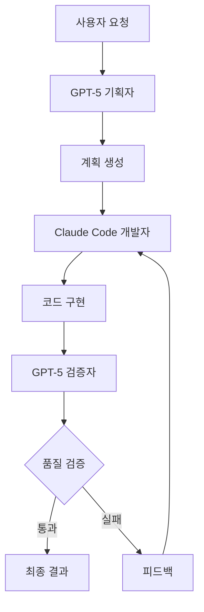

# 1-6: 이중 LLM 인지 아키텍처 구축 - GPT-5(기획자)와 Claude Code(개발자) 연동하기

## 📋 개요

이중 LLM 인지 아키텍처는 서로 다른 강점을 가진 AI 모델을 조합하여 더 안정적이고 효과적인 에이전트 시스템을 구축하는 방법입니다. GPT-5의 창의적 기획 능력과 Claude Code의 정밀한 구현 능력을 결합하는 방법을 학습합니다.

## 🎯 학습 목표

이 가이드를 완료하면 다음을 달성할 수 있습니다:

1. **이중 LLM 아키텍처의 원리와 장점 이해**
2. **GPT-5와 Claude Code의 특성과 활용법 파악**
3. **두 모델 간의 효과적인 연동 방법 습득**
4. **실제 프로젝트에 이중 LLM 시스템 적용**

## 🧠 이중 LLM 아키텍처의 핵심 원리

### 왜 이중 LLM인가?

#### 단일 모델의 한계
- **범용성 vs 전문성**: 하나의 모델이 모든 것을 잘할 수 없음
- **일관성 부족**: 같은 입력에 대해 다른 결과 생성
- **검증 어려움**: 자체 검증이 어려움

#### 이중 모델의 장점
- **전문성 활용**: 각 모델의 강점을 최대화
- **상호 검증**: 모델 간 교차 검증 가능
- **안정성 향상**: 단일 실패점 제거
- **품질 보장**: 이중 검증으로 품질 향상

### 아키텍처 설계 원칙



## 🎯 GPT-5: 창의적 기획자

### GPT-5의 강점
- **거대한 컨텍스트**: 400k 토큰으로 복잡한 맥락 이해
- **멀티모달**: 텍스트, 이미지, 코드를 통합 처리
- **창의적 사고**: 혁신적이고 창의적인 솔루션 제안
- **전략적 계획**: 장기적이고 전략적인 관점

### GPT-5 활용 전략

#### 1. 요구사항 분석 및 명세 생성
```python
class GPT5Planner:
    def __init__(self, api_key):
        self.client = OpenAI(api_key=api_key)
        self.model = "gpt-5"
    
    def analyze_requirements(self, user_request):
        prompt = f"""
        사용자 요청을 분석하고 상세한 명세서를 생성하세요:
        
        요청: {user_request}
        
        다음 구조로 명세서를 작성하세요:
        1. 프로젝트 개요
        2. 기능 요구사항
        3. 기술 요구사항
        4. 사용자 경험 요구사항
        5. 성공 기준
        """
        
        response = self.client.chat.completions.create(
            model=self.model,
            messages=[{"role": "user", "content": prompt}],
            temperature=0.7
        )
        
        return response.choices[0].message.content
    
    def create_architecture_plan(self, spec):
        prompt = f"""
        명세서를 바탕으로 기술 아키텍처 계획을 수립하세요:
        
        명세서: {spec}
        
        다음을 포함하세요:
        1. 시스템 아키텍처
        2. 기술 스택 선택
        3. 데이터 모델 설계
        4. API 설계
        5. 보안 고려사항
        """
        
        response = self.client.chat.completions.create(
            model=self.model,
            messages=[{"role": "user", "content": prompt}],
            temperature=0.5
        )
        
        return response.choices[0].message.content
```markdown

#### 2. 전략적 계획 수립
```python
    def create_strategic_plan(self, requirements):
        prompt = f"""
        요구사항을 바탕으로 전략적 실행 계획을 수립하세요:
        
        요구사항: {requirements}
        
        계획에 포함할 내용:
        1. 단계별 실행 계획
        2. 리소스 할당
        3. 위험 요소 분석
        4. 성공 지표 정의
        5. 대안 계획
        """
        
        response = self.client.chat.completions.create(
            model=self.model,
            messages=[{"role": "user", "content": prompt}],
            temperature=0.6
        )
        
        return response.choices[0].message.content
```markdown

## 🔧 Claude Code: 정밀한 개발자

### Claude Code의 강점
- **코드 품질**: 고품질의 안전하고 유지보수 가능한 코드
- **엔터프라이즈 보안**: SOC 2, ISO 27001 인증
- **정밀성**: 작은 컨텍스트에서 정확한 작업 수행
- **안전성**: 기본적으로 읽기 전용으로 작동

### Claude Code 활용 전략

#### 1. 코드 구현
```python
class ClaudeCodeDeveloper:
    def __init__(self, api_key):
        self.client = Anthropic(api_key=api_key)
        self.model = "claude-3-5-sonnet-20241022"
    
    def implement_feature(self, specification, architecture):
        prompt = f"""
        다음 명세와 아키텍처를 바탕으로 코드를 구현하세요:
        
        명세: {specification}
        아키텍처: {architecture}
        
        구현 요구사항:
        1. TypeScript로 구현
        2. 에러 처리 포함
        3. 테스트 코드 작성
        4. 문서화 포함
        5. 보안 고려사항 적용
        """
        
        response = self.client.messages.create(
            model=self.model,
            max_tokens=4000,
            messages=[{"role": "user", "content": prompt}]
        )
        
        return response.content[0].text
    
    def refactor_code(self, code, requirements):
        prompt = f"""
        다음 코드를 리팩토링하세요:
        
        코드: {code}
        요구사항: {requirements}
        
        리팩토링 목표:
        1. 코드 품질 향상
        2. 성능 최적화
        3. 가독성 개선
        4. 유지보수성 향상
        """
        
        response = self.client.messages.create(
            model=self.model,
            max_tokens=4000,
            messages=[{"role": "user", "content": prompt}]
        )
        
        return response.content[0].text
```markdown

#### 2. 코드 검증 및 테스트
```python
    def generate_tests(self, code, test_requirements):
        prompt = f"""
        다음 코드에 대한 테스트를 작성하세요:
        
        코드: {code}
        테스트 요구사항: {test_requirements}
        
        테스트 유형:
        1. 단위 테스트
        2. 통합 테스트
        3. 엣지 케이스 테스트
        4. 성능 테스트
        """
        
        response = self.client.messages.create(
            model=self.model,
            max_tokens=4000,
            messages=[{"role": "user", "content": prompt}]
        )
        
        return response.content[0].text
```markdown

## 🔄 이중 LLM 연동 시스템

### 통합 아키텍처

```python
class DualLLMOrchestrator:
    def __init__(self, gpt5_api_key, claude_api_key):
        self.gpt5_planner = GPT5Planner(gpt5_api_key)
        self.claude_developer = ClaudeCodeDeveloper(claude_api_key)
        self.verification_loop = VerificationLoop()
    
    def process_request(self, user_request):
        # 1단계: GPT-5로 요구사항 분석 및 계획 수립
        spec = self.gpt5_planner.analyze_requirements(user_request)
        architecture = self.gpt5_planner.create_architecture_plan(spec)
        plan = self.gpt5_planner.create_strategic_plan(spec)
        
        # 2단계: Claude Code로 구현
        implementation = self.claude_developer.implement_feature(spec, architecture)
        tests = self.claude_developer.generate_tests(implementation, spec)
        
        # 3단계: GPT-5로 검증
        verification_result = self.verification_loop.verify(
            spec, architecture, implementation, tests
        )
        
        if verification_result["passed"]:
            return {
                "status": "success",
                "specification": spec,
                "architecture": architecture,
                "implementation": implementation,
                "tests": tests,
                "verification": verification_result
            }
        else:
            # 피드백을 바탕으로 재구현
            feedback = verification_result["feedback"]
            improved_implementation = self.claude_developer.refactor_code(
                implementation, feedback
            )
            
            return self.process_refinement(
                spec, architecture, improved_implementation, feedback
            )
```markdown

### 검증 루프 구현

```python
class VerificationLoop:
    def __init__(self, gpt5_api_key):
        self.gpt5 = GPT5Planner(gpt5_api_key)
    
    def verify(self, spec, architecture, implementation, tests):
        verification_prompt = f"""
        다음 구현이 원본 명세와 아키텍처를 올바르게 따르는지 검증하세요:
        
        명세: {spec}
        아키텍처: {architecture}
        구현: {implementation}
        테스트: {tests}
        
        검증 항목:
        1. 기능 요구사항 충족 여부
        2. 아키텍처 준수 여부
        3. 코드 품질
        4. 보안 요구사항
        5. 성능 요구사항
        6. 테스트 커버리지
        
        각 항목에 대해 통과/실패를 판정하고, 실패한 경우 구체적인 개선 사항을 제시하세요.
        """
        
        response = self.gpt5.client.chat.completions.create(
            model="gpt-5",
            messages=[{"role": "user", "content": verification_prompt}],
            temperature=0.3
        )
        
        verification_result = self.parse_verification_result(
            response.choices[0].message.content
        )
        
        return verification_result
    
    def parse_verification_result(self, verification_text):
        # GPT-5의 검증 결과를 파싱하여 구조화된 데이터로 변환
        lines = verification_text.split('\n')
        
        results = {}
        feedback = []
        
        for line in lines:
            if "통과" in line:
                results[line.split(':')[0].strip()] = True
            elif "실패" in line:
                results[line.split(':')[0].strip()] = False
                feedback.append(line)
        
        passed = all(results.values())
        
        return {
            "passed": passed,
            "results": results,
            "feedback": feedback
        }
```markdown

## 🛠️ 실습: 이중 LLM 시스템 구축

### 프로젝트 설정

```bash
# 프로젝트 초기화
mkdir dual-llm-system
cd dual-llm-system

# 가상환경 설정
python -m venv venv
source venv/bin/activate

# 의존성 설치
pip install openai anthropic python-dotenv
```markdown

### 환경 변수 설정

```bash
# .env 파일 생성
echo "OPENAI_API_KEY=your_openai_api_key" >> .env
echo "ANTHROPIC_API_KEY=your_anthropic_api_key" >> .env
```markdown

### 메인 시스템 구현

```python
# main.py
import os
from dotenv import load_dotenv
from dual_llm_orchestrator import DualLLMOrchestrator

# 환경 변수 로드
load_dotenv()

def main():
    # API 키 설정
    gpt5_api_key = os.getenv("OPENAI_API_KEY")
    claude_api_key = os.getenv("ANTHROPIC_API_KEY")
    
    # 이중 LLM 오케스트레이터 초기화
    orchestrator = DualLLMOrchestrator(gpt5_api_key, claude_api_key)
    
    # 사용자 요청 처리
    user_request = """
    온라인 쇼핑몰의 장바구니 기능을 구현해주세요.
    - 상품 추가/삭제
    - 수량 조절
    - 총 금액 계산
    - 반응형 디자인
    """
    
    result = orchestrator.process_request(user_request)
    
    if result["status"] == "success":
        print("✅ 구현 완료!")
        print(f"명세서: {result['specification'][:200]}...")
        print(f"구현 코드: {result['implementation'][:200]}...")
    else:
        print("❌ 구현 실패")
        print(f"오류: {result['error']}")

if __name__ == "__main__":
    main()
```markdown

### 고급 기능 구현

#### 1. 지속적 학습 시스템
```python
class ContinuousLearningSystem:
    def __init__(self, orchestrator):
        self.orchestrator = orchestrator
        self.performance_history = []
        self.improvement_suggestions = []
    
    def track_performance(self, request, result):
        performance_metrics = {
            "request_complexity": self.assess_complexity(request),
            "implementation_quality": self.assess_quality(result),
            "verification_passes": result["verification"]["passed"],
            "feedback_count": len(result["verification"]["feedback"]),
            "timestamp": datetime.now()
        }
        
        self.performance_history.append(performance_metrics)
        
        # 성능 개선 제안 생성
        if performance_metrics["verification_passes"] == False:
            self.generate_improvement_suggestions(performance_metrics)
    
    def assess_complexity(self, request):
        # 요청의 복잡도를 평가하는 로직
        complexity_keywords = ["복잡한", "고급", "엔터프라이즈", "대규모"]
        complexity_score = sum(1 for keyword in complexity_keywords if keyword in request)
        return min(complexity_score / 4, 1.0)
    
    def assess_quality(self, result):
        # 구현 품질을 평가하는 로직
        quality_indicators = [
            "에러 처리" in result["implementation"],
            "테스트" in result["tests"],
            "문서화" in result["implementation"],
            "타입 안정성" in result["implementation"]
        ]
        return sum(quality_indicators) / len(quality_indicators)
```markdown

#### 2. 적응형 프롬프트 시스템
```python
class AdaptivePromptSystem:
    def __init__(self):
        self.prompt_templates = {}
        self.success_patterns = {}
    
    def get_optimized_prompt(self, task_type, context):
        base_template = self.prompt_templates.get(task_type, self.get_default_template())
        
        # 성공 패턴을 바탕으로 프롬프트 최적화
        if task_type in self.success_patterns:
            optimizations = self.success_patterns[task_type]
            optimized_template = self.apply_optimizations(base_template, optimizations)
            return optimized_template
        
        return base_template
    
    def learn_from_success(self, task_type, prompt, result):
        if result["verification"]["passed"]:
            if task_type not in self.success_patterns:
                self.success_patterns[task_type] = []
            
            # 성공한 프롬프트의 패턴을 학습
            success_pattern = self.extract_success_pattern(prompt, result)
            self.success_patterns[task_type].append(success_pattern)
```markdown

## 📊 성능 모니터링

### 핵심 지표

#### 1. 품질 지표
- **검증 통과율**: GPT-5 검증에서 통과하는 비율
- **코드 품질 점수**: Claude Code 구현의 품질 점수
- **재작업 비율**: 검증 실패로 인한 재작업 비율

#### 2. 효율성 지표
- **처리 시간**: 요청부터 완료까지 소요 시간
- **토큰 사용량**: 각 모델의 토큰 사용 효율성
- **비용 효율성**: 결과 품질 대비 비용

#### 3. 협업 지표
- **피드백 품질**: GPT-5가 제공하는 피드백의 유용성
- **개선 효과**: 피드백 반영 후 품질 향상 정도
- **학습 속도**: 시스템이 개선되는 속도

### 모니터링 대시보드

```python
class MonitoringDashboard:
    def __init__(self, orchestrator):
        self.orchestrator = orchestrator
        self.metrics = {}
    
    def generate_dashboard(self):
        dashboard_data = {
            "quality_metrics": self.get_quality_metrics(),
            "efficiency_metrics": self.get_efficiency_metrics(),
            "collaboration_metrics": self.get_collaboration_metrics(),
            "trends": self.get_trend_analysis()
        }
        
        return dashboard_data
    
    def get_quality_metrics(self):
        return {
            "verification_pass_rate": self.calculate_pass_rate(),
            "average_code_quality": self.calculate_average_quality(),
            "refactoring_frequency": self.calculate_refactoring_frequency()
        }
    
    def get_efficiency_metrics(self):
        return {
            "average_processing_time": self.calculate_average_time(),
            "token_efficiency": self.calculate_token_efficiency(),
            "cost_per_success": self.calculate_cost_efficiency()
        }
```

## 🚀 다음 단계

이 가이드를 완료한 후에는 다음 단계로 진행하세요:

1. **[1-7: 검증 루프 구현](1-7-verification-loop.md)**
2. **[1-8: 오케스트레이션 프레임워크 선택](1-8-orchestration-framework.md)**

## 📚 추가 리소스

- [OpenAI API Documentation](https://platform.openai.com/docs)
- [Anthropic Claude API](https://docs.anthropic.com/)
- [Multi-Model AI Systems](https://multi-model-ai.dev/)

---

**"두 개의 뇌가 하나보다 강하다"** - 이중 LLM 아키텍처의 핵심
