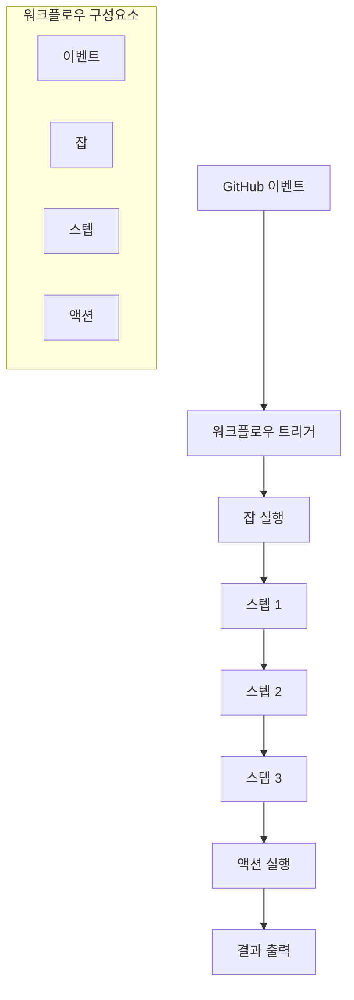

# GitHub Actions 101: 첫 번째 CI/CD 워크플로우 자동화

## 개요

GitHub Actions는 GitHub 저장소에서 직접 CI/CD(지속적 통합/지속적 배포) 워크플로우를 구축, 테스트, 배포할 수 있는 플랫폼입니다. 이 가이드에서는 에이전틱 SaaS 조직을 위한 첫 번째 자동화 워크플로우를 구축하는 방법을 학습합니다.

## 학습 목표

이 가이드를 완료하면 다음을 할 수 있습니다:
- GitHub Actions의 기본 개념과 구조 이해
- 첫 번째 워크플로우 파일 작성 및 실행
- 에이전틱 프로젝트에 적합한 자동화 파이프라인 구축
- 워크플로우 디버깅 및 최적화 방법 습득

## 핵심 개념

### GitHub Actions 기본 구조

GitHub Actions는 다음과 같은 핵심 구성 요소로 이루어집니다:

- **워크플로우(Workflow)**: 자동화할 작업의 전체 과정
- **이벤트(Event)**: 워크플로우를 트리거하는 활동
- **잡(Job)**: 워크플로우 내의 실행 단위
- **스텝(Step)**: 잡 내의 개별 작업
- **액션(Action)**: 재사용 가능한 작업 단위



### 워크플로우 파일 구조

```yaml
name: 워크플로우 이름

on:  # 트리거 이벤트
  push:
    branches: [ main ]
  pull_request:
    branches: [ main ]

jobs:  # 실행할 작업들
  job-name:
    runs-on: ubuntu-latest
    steps:
      - name: 스텝 이름
        uses: action-name@version
```

## 실습: 첫 번째 워크플로우 만들기

### 1단계: 기본 워크플로우 생성

`.github/workflows/` 디렉토리에 첫 번째 워크플로우 파일을 생성합니다:

```yaml
name: 에이전틱 프로젝트 CI

on:
  push:
    branches: [ main, develop ]
  pull_request:
    branches: [ main ]

jobs:
  test:
    runs-on: ubuntu-latest
    
    steps:
    - name: 코드 체크아웃
      uses: actions/checkout@v4
      
    - name: Python 설정
      uses: actions/setup-python@v4
      with:
        python-version: '3.9'
        
    - name: 의존성 설치
      run: |
        python -m pip install --upgrade pip
        pip install -r requirements.txt
        
    - name: 린터 실행
      run: |
        flake8 . --count --select=E9,F63,F7,F82 --show-source --statistics
        flake8 . --count --exit-zero --max-complexity=10 --max-line-length=127 --statistics
        
    - name: 테스트 실행
      run: |
        pytest tests/ -v --cov=src --cov-report=xml
        
    - name: 커버리지 업로드
      uses: codecov/codecov-action@v3
      with:
        file: ./coverage.xml
```

### 2단계: 에이전틱 프로젝트용 고급 워크플로우

에이전틱 프로젝트의 특성을 고려한 고급 워크플로우를 만들어보겠습니다:

```yaml
name: 에이전틱 SaaS 자동화

on:
  push:
    branches: [ main, develop ]
  pull_request:
    branches: [ main ]
  workflow_dispatch:  # 수동 실행 가능
    inputs:
      environment:
        description: '배포 환경'
        required: true
        default: 'staging'
        type: choice
        options:
        - staging
        - production

env:
  PYTHON_VERSION: '3.9'
  NODE_VERSION: '18'

jobs:
  # 코드 품질 검사
  quality-check:
    runs-on: ubuntu-latest
    outputs:
      quality-passed: ${{ steps.quality-check.outputs.passed }}
    
    steps:
    - name: 코드 체크아웃
      uses: actions/checkout@v4
      
    - name: Python 설정
      uses: actions/setup-python@v4
      with:
        python-version: ${{ env.PYTHON_VERSION }}
        
    - name: Node.js 설정
      uses: actions/setup-node@v4
      with:
        node-version: ${{ env.NODE_VERSION }}
        
    - name: 의존성 설치
      run: |
        python -m pip install --upgrade pip
        pip install -r requirements.txt
        npm install
        
    - name: 코드 품질 검사
      id: quality-check
      run: |
        # Python 린터
        flake8 . --count --select=E9,F63,F7,F82 --show-source --statistics
        black --check .
        
        # JavaScript/TypeScript 린터
        npm run lint
        
        echo "passed=true" >> $GITHUB_OUTPUT
        
    - name: 보안 검사
      run: |
        pip install safety
        safety check
        npm audit --audit-level moderate

  # 테스트 실행
  test:
    runs-on: ubuntu-latest
    needs: quality-check
    if: needs.quality-check.outputs.quality-passed == 'true'
    
    strategy:
      matrix:
        python-version: ['3.8', '3.9', '3.10']
        
    steps:
    - name: 코드 체크아웃
      uses: actions/checkout@v4
      
    - name: Python ${{ matrix.python-version }} 설정
      uses: actions/setup-python@v4
      with:
        python-version: ${{ matrix.python-version }}
        
    - name: 의존성 설치
      run: |
        python -m pip install --upgrade pip
        pip install -r requirements.txt
        pip install -r requirements-test.txt
        
    - name: 테스트 실행
      run: |
        pytest tests/ -v --cov=src --cov-report=xml --junitxml=test-results.xml
        
    - name: 테스트 결과 업로드
      uses: actions/upload-artifact@v3
      if: always()
      with:
        name: test-results-${{ matrix.python-version }}
        path: test-results.xml

  # 빌드 및 배포
  build-and-deploy:
    runs-on: ubuntu-latest
    needs: [quality-check, test]
    if: github.ref == 'refs/heads/main' && github.event_name == 'push'
    
    steps:
    - name: 코드 체크아웃
      uses: actions/checkout@v4
      
    - name: Python 설정
      uses: actions/setup-python@v4
      with:
        python-version: ${{ env.PYTHON_VERSION }}
        
    - name: 의존성 설치
      run: |
        python -m pip install --upgrade pip
        pip install -r requirements.txt
        
    - name: Docker 이미지 빌드
      run: |
        docker build -t agentic-saas:${{ github.sha }} .
        docker tag agentic-saas:${{ github.sha }} agentic-saas:latest
        
    - name: Docker Hub 로그인
      uses: docker/login-action@v3
      with:
        username: ${{ secrets.DOCKER_USERNAME }}
        password: ${{ secrets.DOCKER_PASSWORD }}
        
    - name: 이미지 푸시
      run: |
        docker push agentic-saas:${{ github.sha }}
        docker push agentic-saas:latest
        
    - name: 배포
      run: |
        echo "배포 환경: ${{ github.event.inputs.environment || 'staging' }}"
        # 실제 배포 스크립트 실행
        ./scripts/deploy.sh ${{ github.event.inputs.environment || 'staging' }}
```

### 3단계: 에이전트 기반 워크플로우

AI 에이전트와 연동되는 워크플로우를 만들어보겠습니다:

```yaml
name: AI 에이전트 자동화

on:
  issues:
    types: [opened, labeled]
  issue_comment:
    types: [created]

jobs:
  # 이슈 분석 및 명세 생성
  analyze-issue:
    runs-on: ubuntu-latest
    if: github.event_name == 'issues' && github.event.action == 'opened'
    
    steps:
    - name: 코드 체크아웃
      uses: actions/checkout@v4
      
    - name: Python 설정
      uses: actions/setup-python@v4
      with:
        python-version: '3.9'
        
    - name: 의존성 설치
      run: |
        pip install -r requirements.txt
        pip install openai anthropic
        
    - name: 이슈 분석
      env:
        OPENAI_API_KEY: ${{ secrets.OPENAI_API_KEY }}
        ANTHROPIC_API_KEY: ${{ secrets.ANTHROPIC_API_KEY }}
      run: |
        python scripts/analyze_issue.py \
          --issue-number ${{ github.event.issue.number }} \
          --repository ${{ github.repository }}
          
    - name: 명세 생성
      env:
        OPENAI_API_KEY: ${{ secrets.OPENAI_API_KEY }}
      run: |
        python scripts/generate_spec.py \
          --issue-number ${{ github.event.issue.number }} \
          --output spec.md
          
    - name: 명세 파일 커밋
      run: |
        git config --local user.email "action@github.com"
        git config --local user.name "GitHub Action"
        git add spec.md
        git commit -m "feat: 이슈 #${{ github.event.issue.number }} 명세 생성" || exit 0
        git push

  # 코드 생성 및 리뷰
  generate-code:
    runs-on: ubuntu-latest
    if: github.event_name == 'issue_comment' && contains(github.event.comment.body, '/generate')
    
    steps:
    - name: 코드 체크아웃
      uses: actions/checkout@v4
      
    - name: Python 설정
      uses: actions/setup-python@v4
      with:
        python-version: '3.9'
        
    - name: 의존성 설치
      run: |
        pip install -r requirements.txt
        pip install openai anthropic crewai
        
    - name: 코드 생성
      env:
        OPENAI_API_KEY: ${{ secrets.OPENAI_API_KEY }}
        ANTHROPIC_API_KEY: ${{ secrets.ANTHROPIC_API_KEY }}
      run: |
        python scripts/generate_code.py \
          --issue-number ${{ github.event.issue.number }} \
          --comment-id ${{ github.event.comment.id }}
          
    - name: 코드 리뷰
      env:
        OPENAI_API_KEY: ${{ secrets.OPENAI_API_KEY }}
      run: |
        python scripts/review_code.py \
          --issue-number ${{ github.event.issue.number }}
          
    - name: PR 생성
      env:
        GITHUB_TOKEN: ${{ secrets.GITHUB_TOKEN }}
      run: |
        python scripts/create_pr.py \
          --issue-number ${{ github.event.issue.number }}
```

## 고급 기능

### 1. 시크릿 관리

GitHub Secrets를 사용하여 민감한 정보를 안전하게 관리합니다:

```yaml
- name: API 호출
  env:
    API_KEY: ${{ secrets.API_KEY }}
    DATABASE_URL: ${{ secrets.DATABASE_URL }}
  run: |
    python scripts/api_call.py
```

### 2. 아티팩트 관리

빌드 결과물을 저장하고 다른 잡에서 사용할 수 있습니다:

```yaml
- name: 빌드 아티팩트 업로드
  uses: actions/upload-artifact@v3
  with:
    name: build-artifacts
    path: dist/
    
- name: 아티팩트 다운로드
  uses: actions/download-artifact@v3
  with:
    name: build-artifacts
    path: dist/
```

### 3. 환경별 배포

다양한 환경에 대한 배포 전략을 구현합니다:

```yaml
deploy:
  runs-on: ubuntu-latest
  environment: ${{ github.event.inputs.environment || 'staging' }}
  
  steps:
  - name: 환경별 배포
    run: |
      if [ "${{ github.event.inputs.environment }}" = "production" ]; then
        ./scripts/deploy-production.sh
      else
        ./scripts/deploy-staging.sh
      fi
```

### 4. 워크플로우 재사용

공통 워크플로우를 만들어 재사용할 수 있습니다:

```yaml
# .github/workflows/common-test.yml
name: 공통 테스트

on:
  workflow_call:
    inputs:
      python-version:
        required: true
        type: string
      test-command:
        required: false
        type: string
        default: 'pytest'

jobs:
  test:
    runs-on: ubuntu-latest
    steps:
    - uses: actions/checkout@v4
    - uses: actions/setup-python@v4
      with:
        python-version: ${{ inputs.python-version }}
    - run: ${{ inputs.test-command }}
```

## 디버깅 및 최적화

### 1. 워크플로우 디버깅

```yaml
- name: 디버그 정보 출력
  run: |
    echo "GitHub 컨텍스트:"
    echo "이벤트: ${{ github.event_name }}"
    echo "액션: ${{ github.event.action }}"
    echo "브랜치: ${{ github.ref }}"
    echo "커밋: ${{ github.sha }}"
```

### 2. 워크플로우 최적화

- **캐싱 활용**: 의존성 설치 시간 단축
- **병렬 실행**: 독립적인 잡들을 병렬로 실행
- **조건부 실행**: 필요한 경우에만 잡 실행

```yaml
- name: pip 캐시 설정
  uses: actions/cache@v3
  with:
    path: ~/.cache/pip
    key: ${{ runner.os }}-pip-${{ hashFiles('**/requirements.txt') }}
    restore-keys: |
      ${{ runner.os }}-pip-
```

## 다음 단계

이 가이드를 완료한 후 다음 단계를 진행하세요:

1. **[2-2: 자동화의 시작](2-2-automation-triggers.md)**: GitHub 이슈를 트리거로 AI 워크플로우 실행하기
2. **[2-3: 프런트 오피스 구축](2-3-front-office-setup.md)**: 제품 전략가 에이전트 구축하기
3. **[시리즈 3: 디지털 인력 관리](../series-3/3-1-gendd-model.md)**: AI 팀 관리 방법 학습하기

## 추가 리소스

- [GitHub Actions 공식 문서](https://docs.github.com/en/actions)
- [워크플로우 문법 참조](https://docs.github.com/en/actions/using-workflows/workflow-syntax-for-github-actions)
- [액션 마켓플레이스](https://github.com/marketplace?type=actions)
- [에이전틱 프로젝트 예제](../examples/github-actions/)

---

**"자동화로 시작하는 에이전틱 여정"** - GitHub Actions로 첫 번째 자동화 파이프라인을 구축하고 100배 생산성의 기반을 마련하세요!