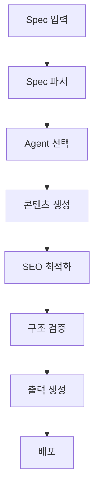

# 블로그 출판 시스템 Spec

## 개요

이 spec은 가이드 시리즈를 markdown 기반 블로그로 출판하고, 향후 다른 주제와 분야의 가이드 시리즈, 온라인 도서를 위한 구조를 정의합니다. Spec Driven Development 구조로 Agent가 하위 spec을 선택해서 진행할 수 있게 설계됩니다.

## 🎯 목표

1. **자동화된 블로그 출판**: Markdown 기반 콘텐츠를 자동으로 블로그로 변환
2. **확장 가능한 구조**: 다양한 주제와 분야의 가이드 시리즈 지원
3. **Agent 기반 개발**: AI Agent가 하위 spec을 선택하여 자동으로 콘텐츠 생성
4. **온라인 도서 지원**: 단일 가이드부터 완전한 온라인 도서까지 지원
5. **SEO 최적화**: 검색 엔진 최적화된 블로그 포스트 생성

## 🏗️ 시스템 아키텍처

### 1. 핵심 컴포넌트

```
publishing-system/
├── content-manager/          # 콘텐츠 관리
├── spec-processor/           # Spec 처리 및 변환
├── blog-generator/           # 블로그 포스트 생성
├── book-generator/           # 온라인 도서 생성
├── seo-optimizer/            # SEO 최적화
├── agent-orchestrator/       # Agent 오케스트레이션
└── deployment-manager/       # 배포 관리
```

### 2. Spec 구조

```
specs/
├── series/                   # 가이드 시리즈
│   ├── series-1/
│   ├── series-2/
│   └── ...
├── books/                    # 온라인 도서
│   ├── book-1/
│   ├── book-2/
│   └── ...
├── templates/                # 템플릿
│   ├── blog-post/
│   ├── book-chapter/
│   └── series-overview/
└── agents/                   # Agent Specs
    ├── content-creator/
    ├── seo-optimizer/
    └── publisher/
```

## 📋 Spec 정의

### 1. 시리즈 Spec 구조

```yaml
# series-spec.yaml
series:
  id: "series-5"
  title: "자율성의 경제학"
  subtitle: "100배 생산성 달성"
  description: "AI와 자동화를 통해 100배 생산성을 달성하는 방법"
  
  metadata:
    author: "AI Agent Team"
    category: "Productivity"
    tags: ["AI", "Automation", "Productivity", "FinOps", "RL"]
    difficulty: "Advanced"
    duration: "10 weeks"
    target_audience: "Developers, DevOps, Product Managers"
  
  structure:
    type: "progressive"
    guides:
      - id: "5-1"
        title: "100배 생산성 정량화"
        type: "foundation"
        prerequisites: []
      - id: "5-2"
        title: "AI FinOps 입문"
        type: "concept"
        prerequisites: ["5-1"]
      # ... 더 많은 가이드들
  
  publishing:
    blog:
      enabled: true
      template: "series-guide"
      seo:
        focus_keyword: "100배 생산성"
        meta_description: "AI와 자동화를 통해 100배 생산성을 달성하는 완전한 가이드"
        tags: ["AI", "Productivity", "Automation"]
    
    book:
      enabled: true
      template: "progressive-book"
      chapters: "auto-generated"
      table_of_contents: true
      index: true
```

### 2. 가이드 Spec 구조

```yaml
# guide-spec.yaml
guide:
  id: "5-1"
  series_id: "series-5"
  title: "100배 생산성 정량화"
  
  content:
    type: "markdown"
    source: "5-1-100x-productivity-quantification.md"
    
  structure:
    sections:
      - type: "overview"
        required: true
      - type: "learning-objectives"
        required: true
      - type: "main-content"
        required: true
      - type: "code-examples"
        required: false
      - type: "next-steps"
        required: true
      - type: "resources"
        required: false
  
  publishing:
    blog:
      template: "guide-post"
      seo:
        focus_keyword: "생산성 정량화"
        meta_description: "생산성 측정의 과학적 접근과 100배 생산성 달성 방법"
        reading_time: "15 min"
        difficulty: "Intermediate"
    
    book:
      chapter_number: 1
      chapter_title: "생산성 정량화의 기초"
```

### 3. Agent Spec 구조

```yaml
# agent-spec.yaml
agent:
  id: "content-creator"
  name: "Content Creator Agent"
  description: "가이드 시리즈 콘텐츠를 자동으로 생성하는 Agent"
  
  capabilities:
    - "markdown-generation"
    - "code-example-creation"
    - "seo-optimization"
    - "content-structuring"
  
  inputs:
    - type: "series-spec"
      required: true
    - type: "guide-spec"
      required: true
    - type: "templates"
      required: true
  
  outputs:
    - type: "markdown-content"
    - type: "blog-post"
    - type: "book-chapter"
  
  workflow:
    steps:
      - "parse-spec"
      - "generate-content"
      - "optimize-seo"
      - "validate-structure"
      - "generate-outputs"
```

## 🔄 워크플로우

### 1. 콘텐츠 생성 워크플로우



### 2. Agent 오케스트레이션

```python
class AgentOrchestrator:
    def __init__(self):
        self.agents = {
            'content-creator': ContentCreatorAgent(),
            'seo-optimizer': SEOOptimizerAgent(),
            'publisher': PublisherAgent(),
            'validator': ContentValidatorAgent()
        }
        self.spec_processor = SpecProcessor()
        self.workflow_engine = WorkflowEngine()
    
    def process_series(self, series_spec):
        """시리즈 처리"""
        # 1. Spec 파싱
        parsed_spec = self.spec_processor.parse(series_spec)
        
        # 2. Agent 선택 및 실행
        for guide_spec in parsed_spec.guides:
            # 콘텐츠 생성
            content = self.agents['content-creator'].create_content(guide_spec)
            
            # SEO 최적화
            optimized_content = self.agents['seo-optimizer'].optimize(content)
            
            # 검증
            validation_result = self.agents['validator'].validate(optimized_content)
            
            if validation_result.valid:
                # 출판
                self.agents['publisher'].publish(optimized_content)
    
    def process_book(self, book_spec):
        """온라인 도서 처리"""
        # 시리즈를 온라인 도서로 변환
        book_content = self.convert_series_to_book(book_spec)
        
        # 도서 구조 생성
        book_structure = self.generate_book_structure(book_content)
        
        # 출판
        self.agents['publisher'].publish_book(book_structure)
```

## 🎨 템플릿 시스템

### 1. 블로그 포스트 템플릿

```html
<!-- blog-post-template.html -->
<!DOCTYPE html>
<html lang="ko">
<head>
    <meta charset="UTF-8">
    <meta name="viewport" content="width=device-width, initial-scale=1.0">
    <title>{{title}} | {{site_name}}</title>
    <meta name="description" content="{{meta_description}}">
    <meta name="keywords" content="{{tags}}">
    
    <!-- SEO Meta Tags -->
    <meta property="og:title" content="{{title}}">
    <meta property="og:description" content="{{meta_description}}">
    <meta property="og:type" content="article">
    <meta property="og:url" content="{{canonical_url}}">
    
    <!-- Twitter Card -->
    <meta name="twitter:card" content="summary_large_image">
    <meta name="twitter:title" content="{{title}}">
    <meta name="twitter:description" content="{{meta_description}}">
    
    <!-- Structured Data -->
    <script type="application/ld+json">
    {
        "@context": "https://schema.org",
        "@type": "Article",
        "headline": "{{title}}",
        "description": "{{meta_description}}",
        "author": {
            "@type": "Person",
            "name": "{{author}}"
        },
        "publisher": {
            "@type": "Organization",
            "name": "{{site_name}}"
        },
        "datePublished": "{{publish_date}}",
        "dateModified": "{{modified_date}}"
    }
    </script>
</head>
<body>
    <article class="blog-post">
        <header class="post-header">
            <h1 class="post-title">{{title}}</h1>
            <div class="post-meta">
                <span class="author">By {{author}}</span>
                <span class="date">{{publish_date}}</span>
                <span class="reading-time">{{reading_time}} min read</span>
            </div>
            <div class="post-tags">
                
                <span class="tag">{{tag}}</span>
                
            </div>
        </header>
        
        <div class="post-content">
            {{content}}
        </div>
        
        <footer class="post-footer">
            <div class="post-navigation">
                
                <a href="{{previous_post.url}}" class="nav-previous">
                    ← {{previous_post.title}}
                </a>
                
                
                <a href="{{next_post.url}}" class="nav-next">
                    {{next_post.title}} →
                </a>
                
            </div>
            
            <div class="post-share">
                <h3>Share this post</h3>
                <div class="share-buttons">
                    <a href="https://twitter.com/intent/tweet?text={{title}}&url={{canonical_url}}" target="_blank">Twitter</a>
                    <a href="https://www.linkedin.com/sharing/share-offsite/?url={{canonical_url}}" target="_blank">LinkedIn</a>
                    <a href="https://www.facebook.com/sharer/sharer.php?u={{canonical_url}}" target="_blank">Facebook</a>
                </div>
            </div>
        </footer>
    </article>
</body>
</html>
```

### 2. 온라인 도서 템플릿

```html
<!-- book-template.html -->
<!DOCTYPE html>
<html lang="ko">
<head>
    <meta charset="UTF-8">
    <meta name="viewport" content="width=device-width, initial-scale=1.0">
    <title>{{book_title}} | {{site_name}}</title>
    
    <!-- Book-specific meta tags -->
    <meta name="book:author" content="{{author}}">
    <meta name="book:isbn" content="{{isbn}}">
    <meta name="book:release_date" content="{{release_date}}">
    
    <!-- Reading progress tracking -->
    <script>
        window.addEventListener('scroll', function() {
            const progress = (window.scrollY / (document.body.scrollHeight - window.innerHeight)) * 100;
            document.getElementById('reading-progress').style.width = progress + '%';
        });
    </script>
</head>
<body>
    <div class="book-container">
        <!-- Reading Progress Bar -->
        <div class="reading-progress">
            <div id="reading-progress" class="progress-bar"></div>
        </div>
        
        <!-- Table of Contents -->
        <nav class="table-of-contents">
            <h2>Table of Contents</h2>
            <ul>
                
                <li>
                    <a href="#{{chapter.id}}">{{chapter.title}}</a>
                    
                    <ul>
                        
                        <li><a href="#{{section.id}}">{{section.title}}</a></li>
                        
                    </ul>
                    
                </li>
                
            </ul>
        </nav>
        
        <!-- Book Content -->
        <main class="book-content">
            <header class="book-header">
                <h1 class="book-title">{{book_title}}</h1>
                <p class="book-subtitle">{{book_subtitle}}</p>
                <div class="book-meta">
                    <span class="author">By {{author}}</span>
                    <span class="pages">{{total_pages}} pages</span>
                    <span class="reading-time">{{total_reading_time}} min read</span>
                </div>
            </header>
            
            
            <section id="{{chapter.id}}" class="chapter">
                <h2 class="chapter-title">{{chapter.title}}</h2>
                <div class="chapter-content">
                    {{chapter.content}}
                </div>
            </section>
            
        </main>
        
        <!-- Book Navigation -->
        <nav class="book-navigation">
            <div class="nav-previous">
                
                <a href="#{{previous_chapter.id}}">← {{previous_chapter.title}}</a>
                
            </div>
            <div class="nav-next">
                
                <a href="#{{next_chapter.id}}">{{next_chapter.title}} →</a>
                
            </div>
        </nav>
    </div>
</body>
</html>
```

## 🤖 Agent 시스템

### 1. Content Creator Agent

```python
class ContentCreatorAgent:
    def __init__(self):
        self.markdown_generator = MarkdownGenerator()
        self.code_example_generator = CodeExampleGenerator()
        self.structure_validator = StructureValidator()
    
    def create_content(self, guide_spec):
        """가이드 콘텐츠 생성"""
        content = {
            'title': guide_spec.title,
            'overview': self.generate_overview(guide_spec),
            'learning_objectives': self.generate_learning_objectives(guide_spec),
            'main_content': self.generate_main_content(guide_spec),
            'code_examples': self.generate_code_examples(guide_spec),
            'next_steps': self.generate_next_steps(guide_spec),
            'resources': self.generate_resources(guide_spec)
        }
        
        # 구조 검증
        validation_result = self.structure_validator.validate(content, guide_spec.structure)
        
        if validation_result.valid:
            return self.markdown_generator.generate(content)
        else:
            return self.fix_content_issues(content, validation_result.issues)
    
    def generate_overview(self, guide_spec):
        """개요 생성"""
        return f"""
## 개요

{guide_spec.description}

이 가이드에서는 {guide_spec.title}에 대해 학습합니다.
        """
    
    def generate_learning_objectives(self, guide_spec):
        """학습 목표 생성"""
        objectives = guide_spec.learning_objectives or []
        
        if not objectives:
            # 기본 학습 목표 생성
            objectives = [
                f"{guide_spec.title}의 기본 개념 이해",
                f"{guide_spec.title}의 실제 적용 방법 학습",
                f"{guide_spec.title}을 활용한 문제 해결 능력 향상"
            ]
        
        objectives_html = "\n".join([f"- {obj}" for obj in objectives])
        
        return f"""
## 학습 목표

이 가이드를 완료하면 다음을 달성할 수 있습니다:

{objectives_html}
        """
    
    def generate_main_content(self, guide_spec):
        """주요 콘텐츠 생성"""
        # Spec에서 콘텐츠 구조 추출
        content_structure = guide_spec.content_structure
        
        # 각 섹션별 콘텐츠 생성
        sections = []
        for section in content_structure:
            section_content = self.generate_section_content(section, guide_spec)
            sections.append(section_content)
        
        return "\n\n".join(sections)
    
    def generate_code_examples(self, guide_spec):
        """코드 예제 생성"""
        if not guide_spec.include_code_examples:
            return ""
        
        code_examples = []
        for example_spec in guide_spec.code_examples:
            example = self.code_example_generator.generate(example_spec)
            code_examples.append(example)
        
        return "\n\n".join(code_examples)
```

### 2. SEO Optimizer Agent

```python
class SEOOptimizerAgent:
    def __init__(self):
        self.keyword_analyzer = KeywordAnalyzer()
        self.meta_generator = MetaGenerator()
        self.content_optimizer = ContentOptimizer()
    
    def optimize(self, content):
        """SEO 최적화"""
        # 키워드 분석
        keywords = self.keyword_analyzer.extract_keywords(content)
        
        # 메타 데이터 생성
        meta_data = self.meta_generator.generate(content, keywords)
        
        # 콘텐츠 최적화
        optimized_content = self.content_optimizer.optimize(content, keywords)
        
        return {
            'content': optimized_content,
            'meta_data': meta_data,
            'keywords': keywords
        }
    
    def generate_meta_data(self, content, keywords):
        """메타 데이터 생성"""
        primary_keyword = keywords[0] if keywords else "AI 가이드"
        
        return {
            'title': f"{content['title']} | {primary_keyword} 완전 가이드",
            'meta_description': self.generate_description(content, primary_keyword),
            'focus_keyword': primary_keyword,
            'tags': keywords[:10],  # 상위 10개 키워드
            'reading_time': self.calculate_reading_time(content),
            'difficulty': self.assess_difficulty(content)
        }
    
    def generate_description(self, content, primary_keyword):
        """메타 설명 생성"""
        # 콘텐츠에서 핵심 내용 추출
        overview = content.get('overview', '')
        learning_objectives = content.get('learning_objectives', '')
        
        # 160자 이내로 설명 생성
        description = f"{overview[:100]}... {primary_keyword}에 대한 완전한 가이드입니다."
        
        if len(description) > 160:
            description = description[:157] + "..."
        
        return description
```

## 📊 성능 지표

### 1. 콘텐츠 품질 지표

- **구조 완성도**: 필수 섹션 포함 여부
- **코드 예제 품질**: 실행 가능한 코드 비율
- **SEO 점수**: 키워드 밀도, 메타 데이터 완성도
- **가독성 점수**: 문장 길이, 단락 구조

### 2. 출판 성능 지표

- **생성 속도**: Spec 입력부터 출판까지 소요 시간
- **자동화 비율**: 수동 개입 없이 완성된 콘텐츠 비율
- **에러율**: 생성 과정에서 발생한 에러 비율
- **검증 통과율**: 구조 검증을 통과한 콘텐츠 비율

## 🚀 배포 전략

### 1. 단계별 배포

1. **개발 환경**: 로컬 개발 및 테스트
2. **스테이징 환경**: 통합 테스트 및 검증
3. **프로덕션 환경**: 실제 서비스 배포

### 2. 자동화된 배포

```yaml
# .github/workflows/publish.yml
name: Publish Content

on:
  push:
    branches: [main]
    paths: ['specs/**/*.md']

jobs:
  publish:
    runs-on: ubuntu-latest
    steps:
      - uses: actions/checkout@v2
      
      - name: Setup Python
        uses: actions/setup-python@v2
        with:
          python-version: '3.9'
      
      - name: Install dependencies
        run: |
          pip install -r requirements.txt
      
      - name: Process Specs
        run: |
          python -m publishing.processor --input specs/ --output dist/
      
      - name: Generate Blog Posts
        run: |
          python -m publishing.blog_generator --input dist/ --output blog/
      
      - name: Generate Books
        run: |
          python -m publishing.book_generator --input dist/ --output books/
      
      - name: Deploy to CDN
        run: |
          aws s3 sync blog/ s3://my-blog-bucket/
          aws s3 sync books/ s3://my-books-bucket/
```

## 📚 다음 단계

이 spec을 기반으로 다음 작업을 진행합니다:

1. **구현 시작**: 핵심 컴포넌트 구현
2. **템플릿 개발**: 블로그 및 도서 템플릿 완성
3. **Agent 구축**: 각종 Agent 구현
4. **테스트**: 전체 시스템 테스트
5. **배포**: 실제 서비스 배포

---

**"Spec Driven 블로그 출판 시스템"** - Markdown 기반 콘텐츠를 자동으로 블로그와 온라인 도서로 변환하는 시스템을 구축하여, AI Agent가 자동으로 고품질 콘텐츠를 생성하고 출판할 수 있게 합니다!
