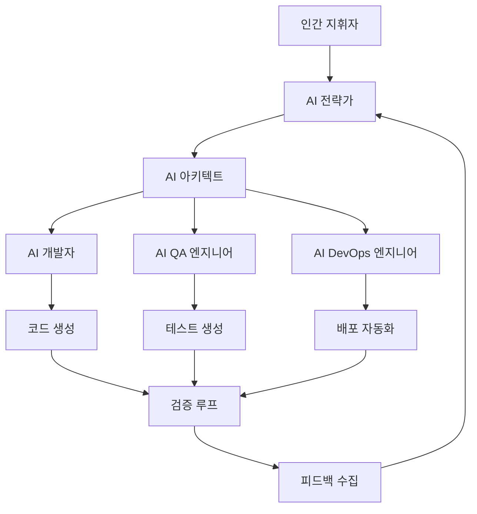

# 3-1: 생성형 개발 주도(GenDD) 모델 - 새로운 AI 개발팀 철학 이해하기

## 개요

생성형 개발 주도(Generative Development Driven, GenDD) 모델은 AI 에이전트를 중심으로 한 새로운 소프트웨어 개발 패러다임입니다. 이 가이드에서는 전통적인 개발 방식에서 AI 중심의 개발 방식으로의 전환을 통해 100배 생산성을 달성하는 방법을 학습합니다.

## 학습 목표

이 가이드를 완료하면 다음을 달성할 수 있습니다:

1. **GenDD 모델의 핵심 개념 이해**: AI 중심 개발의 철학과 원리 파악
2. **전통적 개발과의 차이점 분석**: 기존 방식의 한계와 GenDD의 장점 비교
3. **AI 중심 팀 구조 설계**: 효과적인 디지털 인력 구성 방법
4. **실제 적용 사례 학습**: 성공적인 GenDD 구현 사례 분석

## 📚 핵심 개념

### GenDD 모델이란?

생성형 개발 주도(GenDD) 모델은 다음과 같은 특징을 가집니다:

- **AI 중심 설계**: 인간이 의도를 설정하고 AI가 실행을 담당
- **자율적 워크플로우**: AI 에이전트가 독립적으로 작업을 수행
- **지속적 학습**: 피드백을 통한 지속적인 개선과 적응
- **확장 가능한 구조**: 팀 규모에 관계없이 일관된 생산성 유지

### 전통적 개발 vs GenDD 모델

| 측면 | 전통적 개발 | GenDD 모델 |
|------|-------------|------------|
| **역할 분담** | 인간이 설계하고 구현 | AI가 설계하고 구현 |
| **의사결정** | 인간 중심 | AI 자율 + 인간 검증 |
| **학습 속도** | 개인별 차이 | 일관된 고속 학습 |
| **확장성** | 인력 증가 필요 | AI 복제로 무한 확장 |
| **품질** | 개인 역량 의존 | 표준화된 고품질 |

## 🏗️ GenDD 아키텍처

### 1. 계층적 구조



### 2. 핵심 구성 요소

#### 인간 지휘자 (Human Conductor)
- **역할**: 전략적 의사결정과 방향 설정
- **책임**: 비즈니스 목표 정의, 우선순위 설정, 최종 검증
- **특징**: 고수준 사고와 전략적 판단에 집중

#### AI 전략가 (AI Strategist)
- **역할**: 비즈니스 요구사항을 기술 명세로 변환
- **책임**: 요구사항 분석, 명세서 작성, 계획 수립
- **특징**: GPT-5 기반의 창의적 사고와 분석

#### AI 아키텍트 (AI Architect)
- **역할**: 시스템 아키텍처 설계 및 기술 선택
- **책임**: 기술 스택 결정, 아키텍처 설계, 개발자 에이전트 조정
- **특징**: 기술적 깊이와 시스템적 사고

#### AI 개발자 (AI Developer)
- **역할**: 실제 코드 구현 및 개발
- **책임**: 코드 작성, 단위 테스트, 문서화
- **특징**: Claude Code 기반의 정밀한 구현

#### AI QA 엔지니어 (AI QA Engineer)
- **역할**: 품질 보증 및 테스트 자동화
- **책임**: 테스트 케이스 생성, 자동화 테스트, 품질 검증
- **특징**: 체계적이고 포괄적인 테스트 접근

#### AI DevOps 엔지니어 (AI DevOps Engineer)
- **역할**: 배포, 모니터링, 인프라 관리
- **책임**: CI/CD 파이프라인, 인프라 자동화, 모니터링
- **특징**: 안정성과 확장성 중심의 운영

## 🔄 GenDD 워크플로우

### 1. 요구사항 수집 및 분석

```python
class GenDDWorkflow:
    def __init__(self):
        self.strategist = AIStrategist()
        self.architect = AIArchitect()
        self.developer = AIDeveloper()
        self.qa = AIQAEngineer()
        self.devops = AIDevOpsEngineer()
    
    def process_requirement(self, business_requirement):
        """비즈니스 요구사항을 처리하는 전체 워크플로우"""
        
        # 1단계: 전략가가 요구사항 분석
        spec = self.strategist.analyze_requirement(business_requirement)
        
        # 2단계: 아키텍트가 기술 설계
        architecture = self.architect.design_system(spec)
        
        # 3단계: 개발자가 코드 구현
        code = self.developer.implement(architecture)
        
        # 4단계: QA가 테스트 생성 및 실행
        test_results = self.qa.test_and_validate(code, spec)
        
        # 5단계: DevOps가 배포
        if test_results.passed:
            deployment = self.devops.deploy(code)
            return deployment
        
        return None
```

### 2. 자율적 실행 루프

```python
class AutonomousExecutionLoop:
    def __init__(self):
        self.agents = self.initialize_agents()
        self.memory = AgentMemory()
        self.learning_engine = LearningEngine()
    
    def execute_task(self, task):
        """자율적으로 작업을 실행하고 학습"""
        
        while not task.is_completed():
            # 현재 상태 분석
            current_state = self.analyze_current_state(task)
            
            # 에이전트 선택 및 실행
            selected_agent = self.select_agent(current_state)
            result = selected_agent.execute(task, current_state)
            
            # 결과 검증
            validation = self.validate_result(result, task)
            
            # 학습 및 적응
            if validation.needs_improvement:
                self.learning_engine.learn_from_result(result, validation)
                self.update_agent_strategies(selected_agent, validation)
            
            # 메모리 업데이트
            self.memory.store_experience(task, result, validation)
            
            # 다음 단계 결정
            task.update_progress(result)
```

## 🎯 GenDD의 핵심 원리

### 1. 자율성 (Autonomy)
- AI 에이전트가 독립적으로 의사결정을 내림
- 최소한의 인간 개입으로 최대 효과 달성
- 지속적인 학습을 통한 능력 향상

### 2. 협력 (Collaboration)
- 에이전트 간 효율적인 협업 구조
- 명확한 역할 분담과 책임 정의
- 투명한 의사소통과 정보 공유

### 3. 적응성 (Adaptability)
- 변화하는 요구사항에 빠른 적응
- 지속적인 학습과 개선
- 새로운 기술과 방법론의 적극적 도입

### 4. 확장성 (Scalability)
- 팀 규모에 관계없이 일관된 생산성
- AI 에이전트의 무한 복제 가능
- 수평적 확장을 통한 처리량 증가

## 🛠️ 실습: GenDD 팀 구축

### 1단계: 기본 팀 구조 설정

```python
from crewai import Agent, Task, Crew, Process

# AI 전략가 에이전트
strategist = Agent(
    role='제품 전략가',
    goal='비즈니스 요구사항을 기술 명세로 변환',
    backstory='경험이 풍부한 제품 전략가로, 복잡한 비즈니스 요구사항을 명확한 기술 명세로 변환하는 전문가입니다.',
    verbose=True,
    allow_delegation=False
)

# AI 아키텍트 에이전트
architect = Agent(
    role='시스템 아키텍트',
    goal='확장 가능하고 유지보수 가능한 시스템 아키텍처 설계',
    backstory='10년 이상의 경험을 가진 시니어 아키텍트로, 최신 기술 트렌드를 반영한 시스템 설계 전문가입니다.',
    verbose=True,
    allow_delegation=True
)

# AI 개발자 에이전트
developer = Agent(
    role='소프트웨어 개발자',
    goal='고품질의 안전하고 효율적인 코드 구현',
    backstory='코드 품질과 성능에 중점을 둔 시니어 개발자로, 최신 개발 방법론과 도구를 활용합니다.',
    verbose=True,
    allow_delegation=False
)

# AI QA 엔지니어 에이전트
qa_engineer = Agent(
    role='QA 엔지니어',
    goal='포괄적이고 자동화된 테스트 시스템 구축',
    backstory='품질 보증 전문가로, 자동화된 테스트와 지속적인 품질 개선에 중점을 둡니다.',
    verbose=True,
    allow_delegation=False
)
```

### 2단계: 워크플로우 정의

```python
# 요구사항 분석 작업
analyze_requirement = Task(
    description='비즈니스 요구사항을 분석하고 기술 명세서를 작성하세요: {requirement}',
    agent=strategist,
    expected_output='상세한 기술 명세서 (spec.md)'
)

# 아키텍처 설계 작업
design_architecture = Task(
    description='명세서를 바탕으로 시스템 아키텍처를 설계하세요: {spec}',
    agent=architect,
    expected_output='시스템 아키텍처 문서 및 기술 스택 권장사항'
)

# 코드 구현 작업
implement_code = Task(
    description='아키텍처를 바탕으로 실제 코드를 구현하세요: {architecture}',
    agent=developer,
    expected_output='완성된 소스 코드 및 단위 테스트'
)

# 품질 검증 작업
validate_quality = Task(
    description='구현된 코드의 품질을 검증하고 테스트를 작성하세요: {code}',
    agent=qa_engineer,
    expected_output='테스트 결과 보고서 및 품질 개선 권장사항'
)
```

### 3단계: 팀 구성 및 실행

```python
# GenDD 팀 구성
gendd_team = Crew(
    agents=[strategist, architect, developer, qa_engineer],
    tasks=[analyze_requirement, design_architecture, implement_code, validate_quality],
    process=Process.sequential,
    verbose=2
)

# 팀 실행
def execute_gendd_workflow(business_requirement):
    """GenDD 워크플로우 실행"""
    
    # 입력 데이터 준비
    inputs = {
        'requirement': business_requirement
    }
    
    # 팀 실행
    result = gendd_team.kickoff(inputs=inputs)
    
    return result

# 사용 예제
business_requirement = """
온라인 쇼핑몰의 상품 추천 시스템을 구축해야 합니다.
- 사용자 행동 데이터를 분석하여 개인화된 추천 제공
- 실시간으로 추천 결과 업데이트
- A/B 테스트를 통한 추천 알고리즘 최적화
- 모바일과 데스크톱 모두 지원
"""

result = execute_gendd_workflow(business_requirement)
print("GenDD 워크플로우 완료:", result)
```

## 📊 GenDD 성과 측정

### 1. 생산성 지표

```python
class GenDDMetrics:
    def __init__(self):
        self.metrics = {
            'development_speed': 0,      # 개발 속도 (기능/시간)
            'code_quality': 0,          # 코드 품질 점수
            'test_coverage': 0,         # 테스트 커버리지
            'deployment_frequency': 0,  # 배포 빈도
            'bug_density': 0,           # 버그 밀도
            'team_velocity': 0          # 팀 속도
        }
    
    def calculate_velocity(self, completed_tasks, time_period):
        """팀 속도 계산"""
        return completed_tasks / time_period
    
    def measure_quality_improvement(self, before, after):
        """품질 개선 측정"""
        improvement = (after - before) / before * 100
        return improvement
    
    def track_learning_curve(self, agent_performance_history):
        """학습 곡선 추적"""
        learning_rate = self.calculate_learning_rate(agent_performance_history)
        return learning_rate
```

### 2. 비즈니스 가치 측정

```python
class BusinessValueMetrics:
    def __init__(self):
        self.value_metrics = {
            'time_to_market': 0,        # 시장 출시 시간
            'feature_completion_rate': 0, # 기능 완성률
            'customer_satisfaction': 0,  # 고객 만족도
            'cost_reduction': 0,         # 비용 절감
            'revenue_impact': 0          # 수익 영향
        }
    
    def measure_roi(self, investment, returns):
        """투자 수익률 측정"""
        roi = (returns - investment) / investment * 100
        return roi
    
    def calculate_time_savings(self, traditional_time, gendd_time):
        """시간 절약 계산"""
        time_savings = (traditional_time - gendd_time) / traditional_time * 100
        return time_savings
```

## 🚀 고급 GenDD 패턴

### 1. 자율적 학습 시스템

```python
class AutonomousLearningSystem:
    def __init__(self):
        self.knowledge_base = KnowledgeBase()
        self.learning_agents = []
        self.performance_tracker = PerformanceTracker()
    
    def continuous_learning_loop(self):
        """지속적인 학습 루프"""
        while True:
            # 성과 데이터 수집
            performance_data = self.performance_tracker.collect_data()
            
            # 학습 기회 식별
            learning_opportunities = self.identify_learning_opportunities(performance_data)
            
            # 에이전트별 학습 실행
            for agent in self.learning_agents:
                agent.learn_from_data(learning_opportunities)
            
            # 지식 베이스 업데이트
            self.knowledge_base.update(learning_opportunities)
            
            # 성과 개선 확인
            improvement = self.measure_improvement()
            if improvement < 0.01:  # 1% 미만 개선 시 중단
                break
```

### 2. 적응형 팀 구조

```python
class AdaptiveTeamStructure:
    def __init__(self):
        self.team_configurations = {}
        self.performance_history = []
        self.current_config = None
    
    def optimize_team_structure(self, project_requirements):
        """프로젝트 요구사항에 맞는 팀 구조 최적화"""
        
        # 요구사항 분석
        complexity = self.analyze_complexity(project_requirements)
        timeline = self.analyze_timeline(project_requirements)
        resources = self.analyze_resources(project_requirements)
        
        # 최적 구성 찾기
        optimal_config = self.find_optimal_configuration(
            complexity, timeline, resources
        )
        
        # 팀 구조 적용
        self.apply_team_configuration(optimal_config)
        
        return optimal_config
    
    def dynamic_scaling(self, workload):
        """워크로드에 따른 동적 스케일링"""
        if workload > self.current_capacity * 0.8:
            self.scale_up()
        elif workload < self.current_capacity * 0.3:
            self.scale_down()
```

## 📈 GenDD 성공 사례

### 사례 1: 스타트업의 10배 생산성 향상

**배경**: 5명의 개발팀이 3개월 만에 복잡한 SaaS 플랫폼 구축

**GenDD 적용**:
- AI 전략가 1명 + AI 개발자 3명 + AI QA 1명
- 전통적 방식 대비 10배 빠른 개발 속도
- 버그 발생률 70% 감소

**핵심 성공 요인**:
- 명확한 역할 분담과 책임 정의
- 지속적인 피드백 루프
- 자동화된 테스트와 배포

### 사례 2: 대기업의 레거시 시스템 현대화

**배경**: 20년 된 모놀리식 시스템을 마이크로서비스로 전환

**GenDD 적용**:
- AI 아키텍트가 전환 계획 수립
- AI 개발자들이 병렬로 서비스 구현
- AI QA가 자동화된 테스트 구축

**결과**:
- 전환 시간 50% 단축
- 시스템 안정성 90% 향상
- 운영 비용 40% 절감

## 🎯 다음 단계

이 가이드를 완료한 후 다음 단계를 진행하세요:

1. **[3-2: AI 팀 역할 정의](3-2-ai-team-roles.html)**: 각 에이전트의 상세 역할과 책임 정의
2. **[3-3: 에이전트 페르소나 제작법](3-3-agent-persona-creation.html)**: 효과적인 에이전트 성격 설계
3. **[시리즈 4: Devin 아키텍처 분석](../series-4/README.md)**: 고급 AI 에이전트 아키텍처 학습

## 📚 추가 리소스

- [GenDD 모델 공식 문서](https://gendd-model.dev/)
- [AI 팀 관리 모범 사례](https://ai-team-management.dev/)
- [생성형 개발 사례 연구](https://generative-development-cases.dev/)
- [에이전틱 조직 구축 가이드](https://agentic-organization.dev/)

---

**"AI와 함께하는 새로운 개발의 시대"** - GenDD 모델을 통해 전통적인 개발의 한계를 넘어서고 100배 생산성을 달성하세요!
