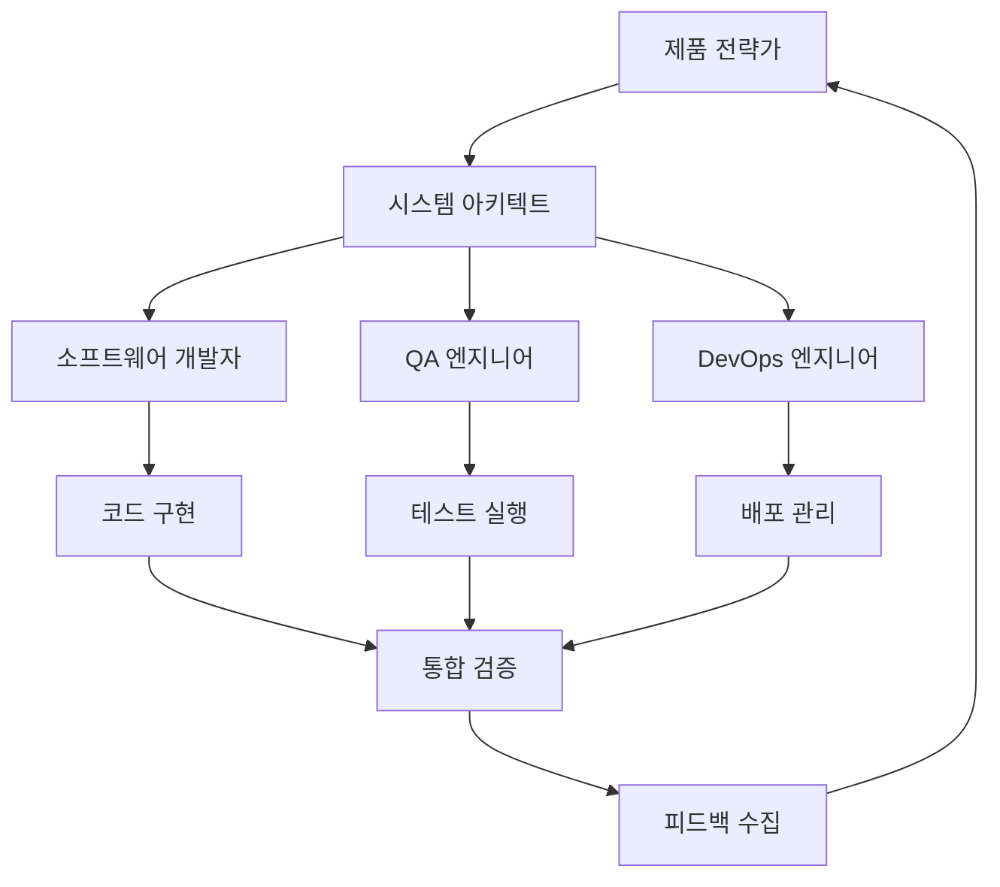

# 3-2: AI 팀 역할 정의 - 제품 전략가부터 QA 엔지니어까지 상세 역할 가이드

## 개요

AI 에이전트 팀의 성공은 각 에이전트의 역할이 명확하게 정의되고 체계적으로 관리될 때 달성됩니다. 이 가이드에서는 AI 에이전트 팀의 핵심 역할들을 상세히 정의하고, 각 역할의 책임, 역량, 그리고 협업 방식을 학습합니다.

## 학습 목표

이 가이드를 완료하면 다음을 달성할 수 있습니다:

1. **AI 에이전트 역할 체계 이해**: 각 역할의 고유한 특성과 책임 파악
2. **역할별 핵심 역량 정의**: 각 에이전트가 갖춰야 할 기술적, 인지적 역량
3. **협업 모델 설계**: 역할 간 효율적인 협업 구조 구축
4. **성과 측정 기준 설정**: 각 역할의 성과를 객관적으로 평가하는 방법

## 🎭 AI 에이전트 역할 체계

### 1. 제품 전략가 (Product Strategist)

#### 역할 정의
비즈니스 요구사항을 분석하고 기술적 명세로 변환하는 전략적 사고자

#### 핵심 책임
- **요구사항 분석**: 비즈니스 요구사항을 기술적 요구사항으로 변환
- **명세서 작성**: 명확하고 실행 가능한 기술 명세서 작성
- **우선순위 설정**: 기능과 작업의 우선순위 결정
- **비즈니스 정렬**: 기술적 결정이 비즈니스 목표와 일치하는지 확인

#### 필수 역량
```python
class ProductStrategistCapabilities:
    def __init__(self):
        self.analytical_thinking = "고급"      # 분석적 사고
        self.business_acumen = "고급"         # 비즈니스 이해도
        self.communication = "고급"           # 의사소통 능력
        self.technical_knowledge = "중급"     # 기술적 지식
        self.creativity = "고급"             # 창의성
        self.decision_making = "고급"        # 의사결정 능력
    
    def analyze_requirement(self, business_requirement):
        """비즈니스 요구사항 분석"""
        return {
            'functional_requirements': self.extract_functional_reqs(business_requirement),
            'non_functional_requirements': self.extract_non_functional_reqs(business_requirement),
            'constraints': self.identify_constraints(business_requirement),
            'success_criteria': self.define_success_criteria(business_requirement)
        }
    
    def create_specification(self, analysis_result):
        """기술 명세서 작성"""
        return {
            'overview': self.create_overview(analysis_result),
            'features': self.define_features(analysis_result),
            'architecture': self.suggest_architecture(analysis_result),
            'acceptance_criteria': self.define_acceptance_criteria(analysis_result)
        }
```

#### 성과 지표
- 명세서 완성도 (100%)
- 요구사항 정확도 (95% 이상)
- 개발팀 이해도 (90% 이상)
- 비즈니스 정렬도 (95% 이상)

### 2. 시스템 아키텍트 (System Architect)

#### 역할 정의
전체 시스템의 아키텍처를 설계하고 기술적 의사결정을 내리는 설계자

#### 핵심 책임
- **아키텍처 설계**: 확장 가능하고 유지보수 가능한 시스템 설계
- **기술 선택**: 프로젝트에 적합한 기술 스택 선택
- **표준 수립**: 개발 표준과 가이드라인 수립
- **성능 최적화**: 시스템 성능과 확장성 고려

#### 필수 역량
```python
class SystemArchitectCapabilities:
    def __init__(self):
        self.system_design = "고급"          # 시스템 설계
        self.technology_knowledge = "고급"   # 기술 지식
        self.scalability_expertise = "고급"  # 확장성 전문성
        self.performance_optimization = "고급" # 성능 최적화
        self.security_knowledge = "중급"     # 보안 지식
        self.documentation = "고급"          # 문서화 능력
    
    def design_architecture(self, requirements):
        """시스템 아키텍처 설계"""
        return {
            'system_overview': self.create_system_overview(requirements),
            'component_design': self.design_components(requirements),
            'data_flow': self.design_data_flow(requirements),
            'integration_points': self.identify_integration_points(requirements),
            'scalability_plan': self.plan_scalability(requirements)
        }
    
    def select_technology_stack(self, requirements):
        """기술 스택 선택"""
        return {
            'frontend': self.select_frontend_tech(requirements),
            'backend': self.select_backend_tech(requirements),
            'database': self.select_database_tech(requirements),
            'infrastructure': self.select_infrastructure_tech(requirements),
            'monitoring': self.select_monitoring_tech(requirements)
        }
```

#### 성과 지표
- 아키텍처 완성도 (100%)
- 기술 선택 적절성 (90% 이상)
- 확장성 점수 (85% 이상)
- 개발팀 만족도 (90% 이상)

### 3. 소프트웨어 개발자 (Software Developer)

#### 역할 정의
명세서와 아키텍처를 바탕으로 실제 코드를 구현하는 실행자

#### 핵심 책임
- **코드 구현**: 명세서에 따른 고품질 코드 작성
- **단위 테스트**: 코드의 신뢰성을 보장하는 테스트 작성
- **코드 리뷰**: 동료 개발자와의 코드 리뷰 참여
- **문서화**: 코드와 API 문서 작성

#### 필수 역량
```python
class SoftwareDeveloperCapabilities:
    def __init__(self):
        self.programming_skills = "고급"     # 프로그래밍 기술
        self.algorithm_knowledge = "고급"    # 알고리즘 지식
        self.testing_skills = "고급"        # 테스트 기술
        self.code_quality = "고급"          # 코드 품질
        self.debugging = "고급"             # 디버깅 능력
        self.collaboration = "중급"         # 협업 능력
    
    def implement_feature(self, specification, architecture):
        """기능 구현"""
        return {
            'code': self.write_code(specification, architecture),
            'unit_tests': self.write_unit_tests(specification),
            'integration_tests': self.write_integration_tests(specification),
            'documentation': self.write_documentation(specification),
            'performance_optimization': self.optimize_performance(specification)
        }
    
    def ensure_code_quality(self, code):
        """코드 품질 보장"""
        return {
            'linting': self.run_linting(code),
            'static_analysis': self.run_static_analysis(code),
            'code_review': self.perform_code_review(code),
            'refactoring': self.refactor_if_needed(code)
        }
```

#### 성과 지표
- 코드 완성도 (100%)
- 테스트 커버리지 (90% 이상)
- 코드 품질 점수 (85% 이상)
- 버그 발생률 (5% 이하)

### 4. QA 엔지니어 (QA Engineer)

#### 역할 정의
소프트웨어의 품질을 보장하고 테스트 자동화를 구축하는 품질 관리자

#### 핵심 책임
- **테스트 계획**: 포괄적인 테스트 전략 수립
- **테스트 자동화**: 자동화된 테스트 시스템 구축
- **품질 검증**: 코드와 시스템의 품질 검증
- **버그 관리**: 버그 발견, 추적, 해결 과정 관리

#### 필수 역량
```python
class QAEngineerCapabilities:
    def __init__(self):
        self.testing_methodology = "고급"    # 테스트 방법론
        self.automation_skills = "고급"     # 자동화 기술
        self.quality_assurance = "고급"     # 품질 보증
        self.bug_analysis = "고급"          # 버그 분석
        self.test_tools = "고급"            # 테스트 도구
        self.performance_testing = "중급"   # 성능 테스트
    
    def create_test_strategy(self, specification):
        """테스트 전략 수립"""
        return {
            'test_plan': self.create_test_plan(specification),
            'test_cases': self.create_test_cases(specification),
            'automation_strategy': self.plan_automation(specification),
            'performance_tests': self.plan_performance_tests(specification),
            'security_tests': self.plan_security_tests(specification)
        }
    
    def implement_test_automation(self, test_strategy):
        """테스트 자동화 구현"""
        return {
            'unit_tests': self.automate_unit_tests(test_strategy),
            'integration_tests': self.automate_integration_tests(test_strategy),
            'e2e_tests': self.automate_e2e_tests(test_strategy),
            'performance_tests': self.automate_performance_tests(test_strategy),
            'ci_cd_integration': self.integrate_with_cicd(test_strategy)
        }
```

#### 성과 지표
- 테스트 커버리지 (95% 이상)
- 자동화율 (90% 이상)
- 버그 발견률 (95% 이상)
- 테스트 실행 시간 (5분 이하)

### 5. DevOps 엔지니어 (DevOps Engineer)

#### 역할 정의
개발과 운영을 연결하고 자동화된 배포 파이프라인을 구축하는 인프라 관리자

#### 핵심 책임
- **CI/CD 파이프라인**: 지속적 통합/배포 파이프라인 구축
- **인프라 관리**: 클라우드 인프라와 서버 관리
- **모니터링**: 시스템 상태와 성능 모니터링
- **보안**: 인프라와 배포 과정의 보안 관리

#### 필수 역량
```python
class DevOpsEngineerCapabilities:
    def __init__(self):
        self.infrastructure_management = "고급"  # 인프라 관리
        self.cicd_expertise = "고급"            # CI/CD 전문성
        self.cloud_platforms = "고급"          # 클라우드 플랫폼
        self.monitoring = "고급"               # 모니터링
        self.security = "중급"                 # 보안
        self.automation = "고급"               # 자동화
    
    def setup_cicd_pipeline(self, project_config):
        """CI/CD 파이프라인 구축"""
        return {
            'build_pipeline': self.setup_build_pipeline(project_config),
            'test_pipeline': self.setup_test_pipeline(project_config),
            'deploy_pipeline': self.setup_deploy_pipeline(project_config),
            'monitoring_pipeline': self.setup_monitoring_pipeline(project_config),
            'rollback_pipeline': self.setup_rollback_pipeline(project_config)
        }
    
    def manage_infrastructure(self, requirements):
        """인프라 관리"""
        return {
            'cloud_setup': self.setup_cloud_infrastructure(requirements),
            'containerization': self.setup_containers(requirements),
            'orchestration': self.setup_orchestration(requirements),
            'scaling': self.setup_auto_scaling(requirements),
            'backup': self.setup_backup_strategy(requirements)
        }
```

#### 성과 지표
- 배포 성공률 (99% 이상)
- 배포 시간 (10분 이하)
- 시스템 가용성 (99.9% 이상)
- 인시던트 대응 시간 (30분 이하)

## 🤝 역할 간 협업 모델

### 1. 계층적 협업 모델



### 2. 협력적 협업 모델

```python
class CollaborativeWorkflow:
    def __init__(self):
        self.agents = {
            'strategist': ProductStrategist(),
            'architect': SystemArchitect(),
            'developer': SoftwareDeveloper(),
            'qa': QAEngineer(),
            'devops': DevOpsEngineer()
        }
        self.communication_channel = CommunicationChannel()
        self.shared_knowledge_base = SharedKnowledgeBase()
    
    def collaborative_planning(self, project_requirements):
        """협력적 계획 수립"""
        # 모든 에이전트가 참여하는 계획 수립
        planning_session = PlanningSession(self.agents)
        
        # 요구사항 분석 (전략가 주도)
        analysis = self.agents['strategist'].analyze_requirements(project_requirements)
        
        # 아키텍처 설계 (아키텍트 주도, 다른 에이전트 피드백)
        architecture = self.agents['architect'].design_architecture(analysis)
        feedback = self.collect_feedback(architecture)
        architecture = self.agents['architect'].refine_architecture(architecture, feedback)
        
        # 구현 계획 (개발자 주도)
        implementation_plan = self.agents['developer'].create_implementation_plan(architecture)
        
        # 테스트 계획 (QA 주도)
        test_plan = self.agents['qa'].create_test_plan(architecture, implementation_plan)
        
        # 배포 계획 (DevOps 주도)
        deployment_plan = self.agents['devops'].create_deployment_plan(architecture)
        
        return {
            'analysis': analysis,
            'architecture': architecture,
            'implementation_plan': implementation_plan,
            'test_plan': test_plan,
            'deployment_plan': deployment_plan
        }
```

### 3. 의사결정 프로세스

```python
class DecisionMakingProcess:
    def __init__(self):
        self.decision_hierarchy = {
            'strategic': ['strategist'],
            'architectural': ['architect', 'strategist'],
            'implementation': ['developer', 'architect'],
            'quality': ['qa', 'developer'],
            'deployment': ['devops', 'qa']
        }
        self.consensus_threshold = 0.8
    
    def make_decision(self, decision_type, options, context):
        """의사결정 프로세스"""
        decision_makers = self.decision_hierarchy[decision_type]
        
        # 각 의사결정자의 의견 수집
        opinions = {}
        for role in decision_makers:
            agent = self.get_agent(role)
            opinions[role] = agent.evaluate_options(options, context)
        
        # 합의 도출
        consensus = self.reach_consensus(opinions)
        
        if consensus['agreement_level'] >= self.consensus_threshold:
            return consensus['decision']
        else:
            # 에스컬레이션
            return self.escalate_decision(decision_type, options, context, opinions)
```

## 📊 성과 측정 및 관리

### 1. 개별 성과 측정

```python
class IndividualPerformanceMetrics:
    def __init__(self):
        self.metrics = {
            'strategist': {
                'spec_quality': 0,
                'requirement_accuracy': 0,
                'business_alignment': 0,
                'team_satisfaction': 0
            },
            'architect': {
                'architecture_completeness': 0,
                'technology_appropriateness': 0,
                'scalability_score': 0,
                'developer_satisfaction': 0
            },
            'developer': {
                'code_completeness': 0,
                'test_coverage': 0,
                'code_quality': 0,
                'bug_rate': 0
            },
            'qa': {
                'test_coverage': 0,
                'automation_rate': 0,
                'bug_detection_rate': 0,
                'test_execution_time': 0
            },
            'devops': {
                'deployment_success_rate': 0,
                'deployment_time': 0,
                'system_availability': 0,
                'incident_response_time': 0
            }
        }
    
    def calculate_performance_score(self, role, metrics_data):
        """성과 점수 계산"""
        role_metrics = self.metrics[role]
        total_score = 0
        weight_sum = 0
        
        for metric, weight in role_metrics.items():
            score = metrics_data.get(metric, 0)
            total_score += score * weight
            weight_sum += weight
        
        return total_score / weight_sum if weight_sum > 0 else 0
```

### 2. 팀 성과 측정

```python
class TeamPerformanceMetrics:
    def __init__(self):
        self.team_metrics = {
            'collaboration_efficiency': 0,
            'communication_quality': 0,
            'conflict_resolution': 0,
            'knowledge_sharing': 0,
            'overall_velocity': 0
        }
    
    def measure_team_effectiveness(self, team_data):
        """팀 효과성 측정"""
        return {
            'collaboration_score': self.calculate_collaboration_score(team_data),
            'communication_score': self.calculate_communication_score(team_data),
            'conflict_resolution_score': self.calculate_conflict_resolution_score(team_data),
            'knowledge_sharing_score': self.calculate_knowledge_sharing_score(team_data),
            'overall_team_score': self.calculate_overall_team_score(team_data)
        }
```

## 🛠️ 실습: AI 팀 역할 구축

### 1단계: 역할 정의 및 설정

```python
from crewai import Agent, Task, Crew

# 제품 전략가 에이전트
strategist = Agent(
    role='제품 전략가',
    goal='비즈니스 요구사항을 명확한 기술 명세로 변환하고 프로젝트의 전략적 방향을 설정',
    backstory='10년 이상의 제품 관리 경험을 가진 시니어 전략가로, 복잡한 비즈니스 요구사항을 기술적으로 실행 가능한 명세로 변환하는 전문가입니다.',
    capabilities={
        'analytical_thinking': '고급',
        'business_acumen': '고급',
        'communication': '고급',
        'technical_knowledge': '중급'
    },
    verbose=True,
    allow_delegation=True
)

# 시스템 아키텍트 에이전트
architect = Agent(
    role='시스템 아키텍트',
    goal='확장 가능하고 유지보수 가능한 시스템 아키텍처를 설계하고 기술적 의사결정을 내림',
    backstory='15년 이상의 시스템 설계 경험을 가진 시니어 아키텍트로, 최신 기술 트렌드와 모범 사례를 반영한 시스템 설계 전문가입니다.',
    capabilities={
        'system_design': '고급',
        'technology_knowledge': '고급',
        'scalability_expertise': '고급',
        'performance_optimization': '고급'
    },
    verbose=True,
    allow_delegation=True
)

# 소프트웨어 개발자 에이전트
developer = Agent(
    role='소프트웨어 개발자',
    goal='명세서와 아키텍처를 바탕으로 고품질의 안전하고 효율적인 코드를 구현',
    backstory='12년 이상의 개발 경험을 가진 시니어 개발자로, 코드 품질과 성능에 중점을 둔 개발 전문가입니다.',
    capabilities={
        'programming_skills': '고급',
        'algorithm_knowledge': '고급',
        'testing_skills': '고급',
        'code_quality': '고급'
    },
    verbose=True,
    allow_delegation=False
)

# QA 엔지니어 에이전트
qa_engineer = Agent(
    role='QA 엔지니어',
    goal='포괄적이고 자동화된 테스트 시스템을 구축하여 소프트웨어 품질을 보장',
    backstory='8년 이상의 QA 경험을 가진 시니어 QA 엔지니어로, 자동화된 테스트와 지속적인 품질 개선에 중점을 둡니다.',
    capabilities={
        'testing_methodology': '고급',
        'automation_skills': '고급',
        'quality_assurance': '고급',
        'bug_analysis': '고급'
    },
    verbose=True,
    allow_delegation=False
)

# DevOps 엔지니어 에이전트
devops_engineer = Agent(
    role='DevOps 엔지니어',
    goal='자동화된 CI/CD 파이프라인을 구축하고 안정적인 인프라를 관리',
    backstory='10년 이상의 DevOps 경험을 가진 시니어 엔지니어로, 클라우드 인프라와 자동화에 전문성을 가지고 있습니다.',
    capabilities={
        'infrastructure_management': '고급',
        'cicd_expertise': '고급',
        'cloud_platforms': '고급',
        'monitoring': '고급'
    },
    verbose=True,
    allow_delegation=False
)
```

### 2단계: 협업 워크플로우 설정

```python
# 협업 워크플로우 정의
collaboration_workflow = {
    'planning_phase': {
        'lead': 'strategist',
        'participants': ['architect', 'qa_engineer'],
        'output': 'project_specification'
    },
    'design_phase': {
        'lead': 'architect',
        'participants': ['developer', 'devops_engineer'],
        'output': 'system_architecture'
    },
    'implementation_phase': {
        'lead': 'developer',
        'participants': ['qa_engineer'],
        'output': 'source_code'
    },
    'testing_phase': {
        'lead': 'qa_engineer',
        'participants': ['developer'],
        'output': 'test_results'
    },
    'deployment_phase': {
        'lead': 'devops_engineer',
        'participants': ['qa_engineer'],
        'output': 'deployed_system'
    }
}

# 팀 구성
ai_team = Crew(
    agents=[strategist, architect, developer, qa_engineer, devops_engineer],
    tasks=[],  # 동적으로 생성
    process=Process.sequential,
    verbose=2
)
```

### 3단계: 성과 모니터링 시스템

```python
class TeamPerformanceMonitor:
    def __init__(self, team):
        self.team = team
        self.metrics_collector = MetricsCollector()
        self.performance_analyzer = PerformanceAnalyzer()
    
    def monitor_team_performance(self):
        """팀 성과 모니터링"""
        # 개별 에이전트 성과 수집
        individual_metrics = {}
        for agent in self.team.agents:
            individual_metrics[agent.role] = self.metrics_collector.collect_agent_metrics(agent)
        
        # 팀 전체 성과 분석
        team_metrics = self.performance_analyzer.analyze_team_performance(individual_metrics)
        
        # 개선 권장사항 생성
        recommendations = self.generate_improvement_recommendations(team_metrics)
        
        return {
            'individual_metrics': individual_metrics,
            'team_metrics': team_metrics,
            'recommendations': recommendations
        }
    
    def generate_improvement_recommendations(self, team_metrics):
        """개선 권장사항 생성"""
        recommendations = []
        
        if team_metrics['collaboration_score'] < 0.8:
            recommendations.append({
                'area': 'collaboration',
                'priority': 'high',
                'action': '협업 프로세스 개선 및 의사소통 강화'
            })
        
        if team_metrics['communication_score'] < 0.8:
            recommendations.append({
                'area': 'communication',
                'priority': 'high',
                'action': '정기적인 동기화 미팅 및 피드백 루프 구축'
            })
        
        return recommendations
```

## 🎯 다음 단계

이 가이드를 완료한 후 다음 단계를 진행하세요:

1. **[3-3: 에이전트 페르소나 제작법](3-3-agent-persona-creation.md)**: 효과적인 에이전트 성격과 동기 부여 시스템 설계
2. **[3-4: 에이전트 협업 모델 설계](3-4-agent-collaboration-models.md)**: 계층적 모델과 협력적 모델의 구현
3. **[3-5: AI 에이전트 간 갈등 해결](3-5-conflict-resolution.md)**: 갈등 해결 메커니즘 구축

## 📚 추가 리소스

- [AI 팀 역할 정의 가이드](https://ai-team-roles.dev/)
- [에이전트 협업 모범 사례](https://agent-collaboration.dev/)
- [성과 측정 프레임워크](https://performance-measurement.dev/)
- [팀 관리 도구](https://team-management-tools.dev/)

---

**"명확한 역할로 시작하는 성공적인 AI 팀"** - 각 에이전트의 역할을 명확히 정의하고 체계적으로 관리하여 최고의 성과를 달성하세요!
