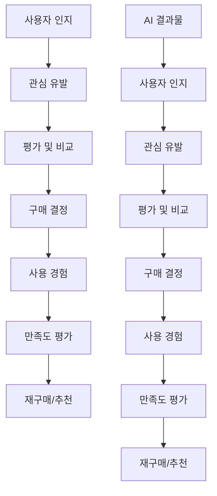

# 3-8: 전략적 검증의 기술 - AI 결과물을 비즈니스 목표와 정렬하는 방법

## 개요

AI 에이전트가 생성하는 결과물의 품질을 단순히 기술적 정확성으로만 평가하는 것은 한계가 있습니다. 전략적 검증은 AI 결과물이 비즈니스 목표와 전략적 방향성에 얼마나 잘 정렬되어 있는지를 평가하고 개선하는 핵심 기술입니다. 이 가이드에서는 AI 결과물을 비즈니스 관점에서 검증하고 지속적으로 개선하는 체계적인 방법을 학습합니다.

## 학습 목표

이 가이드를 완료하면 다음을 달성할 수 있습니다:

1. **전략적 검증 프레임워크 구축**: 비즈니스 목표와 AI 결과물을 연결하는 검증 체계 설계
2. **비즈니스 정렬도 측정**: AI 결과물이 비즈니스 가치를 얼마나 창출하는지 정량적 평가
3. **지속적 개선 메커니즘**: 검증 결과를 바탕으로 AI 시스템을 지속적으로 개선하는 방법
4. **전략적 의사결정 지원**: AI 결과물을 바탕으로 전략적 의사결정을 내리는 능력 개발

## 📚 핵심 개념

### 전략적 검증이란?

전략적 검증은 AI 결과물을 다음 4가지 차원에서 평가하는 포괄적인 접근법입니다:

1. **기술적 정확성**: 코드가 올바르게 작동하는가?
2. **비즈니스 정렬성**: 비즈니스 목표와 일치하는가?
3. **사용자 가치**: 사용자에게 실제 가치를 제공하는가?
4. **전략적 일관성**: 장기적 전략과 조화를 이루는가?

### 전통적 검증 vs 전략적 검증

| 측면 | 전통적 검증 | 전략적 검증 |
|------|-------------|-------------|
| **초점** | 기술적 정확성 | 비즈니스 가치 |
| **측정 지표** | 버그 수, 성능 지표 | 사용자 만족도, 수익성 |
| **검증 시점** | 개발 완료 후 | 개발 전부터 지속적 |
| **개선 방향** | 기술적 최적화 | 비즈니스 가치 극대화 |
| **이해관계자** | 개발팀 중심 | 전체 조직 참여 |

## 🏗️ 전략적 검증 프레임워크

### 1. 비즈니스 가치 매핑

AI 결과물의 비즈니스 가치를 명확히 정의하고 측정하는 과정입니다.

#### 가치 드라이버 식별

```yaml
# 비즈니스 가치 드라이버 예시
value_drivers:
  revenue_growth:
    - "신규 고객 획득"
    - "기존 고객 이탈 방지"
    - "평균 주문 금액 증가"
    - "고객 생애 가치 향상"
  
  cost_reduction:
    - "운영 비용 절감"
    - "인력 효율성 향상"
    - "에러율 감소"
    - "유지보수 비용 절감"
  
  risk_mitigation:
    - "보안 위험 감소"
    - "규정 준수 확보"
    - "시스템 안정성 향상"
    - "데이터 품질 개선"
  
  innovation_acceleration:
    - "개발 속도 향상"
    - "새로운 기능 출시"
    - "시장 대응력 강화"
    - "경쟁 우위 확보"
```

#### 가치 측정 지표 설계

```python
# 비즈니스 가치 측정 시스템
class BusinessValueMeasurer:
    def __init__(self, value_drivers):
        self.value_drivers = value_drivers
        self.metrics = {}
        self.baseline = {}
    
    def define_metrics(self, ai_output, business_context):
        """AI 결과물에 대한 비즈니스 지표 정의"""
        metrics = {}
        
        for driver, indicators in self.value_drivers.items():
            driver_metrics = {}
            for indicator in indicators:
                # 지표별 측정 방법 정의
                measurement_method = self._get_measurement_method(indicator)
                driver_metrics[indicator] = measurement_method(ai_output, business_context)
            
            metrics[driver] = driver_metrics
        
        return metrics
    
    def calculate_value_score(self, metrics):
        """비즈니스 가치 점수 계산"""
        total_score = 0
        weights = self._get_driver_weights()
        
        for driver, driver_metrics in metrics.items():
            driver_score = sum(driver_metrics.values()) / len(driver_metrics)
            weighted_score = driver_score * weights[driver]
            total_score += weighted_score
        
        return total_score
```

### 2. 사용자 중심 검증

사용자의 실제 니즈와 AI 결과물의 일치성을 평가하는 방법입니다.

#### 사용자 여정 매핑



#### 사용자 가치 검증 프레임워크

```python
# 사용자 가치 검증 시스템
class UserValueValidator:
    def __init__(self):
        self.user_personas = {}
        self.journey_maps = {}
        self.value_propositions = {}
    
    def validate_user_value(self, ai_output, user_persona, journey_stage):
        """사용자 가치 검증"""
        validation_results = {}
        
        # 1. 사용자 니즈 충족도 평가
        needs_satisfaction = self._evaluate_needs_satisfaction(
            ai_output, user_persona, journey_stage
        )
        
        # 2. 사용자 경험 품질 평가
        experience_quality = self._evaluate_experience_quality(
            ai_output, user_persona
        )
        
        # 3. 사용자 만족도 예측
        satisfaction_prediction = self._predict_satisfaction(
            needs_satisfaction, experience_quality
        )
        
        validation_results = {
            "needs_satisfaction": needs_satisfaction,
            "experience_quality": experience_quality,
            "satisfaction_prediction": satisfaction_prediction,
            "overall_value_score": self._calculate_overall_value_score(
                needs_satisfaction, experience_quality, satisfaction_prediction
            )
        }
        
        return validation_results
```

### 3. 전략적 일관성 검증

AI 결과물이 조직의 장기 전략과 일치하는지 평가하는 방법입니다.

#### 전략적 정렬도 측정

```python
# 전략적 일관성 검증 시스템
class StrategicConsistencyValidator:
    def __init__(self, strategic_framework):
        self.strategic_framework = strategic_framework
        self.alignment_metrics = {}
    
    def validate_strategic_alignment(self, ai_output, strategic_context):
        """전략적 정렬도 검증"""
        alignment_scores = {}
        
        # 1. 비전 정렬도 평가
        vision_alignment = self._evaluate_vision_alignment(
            ai_output, strategic_context["vision"]
        )
        
        # 2. 미션 정렬도 평가
        mission_alignment = self._evaluate_mission_alignment(
            ai_output, strategic_context["mission"]
        )
        
        # 3. 가치 정렬도 평가
        values_alignment = self._evaluate_values_alignment(
            ai_output, strategic_context["values"]
        )
        
        # 4. 목표 정렬도 평가
        goals_alignment = self._evaluate_goals_alignment(
            ai_output, strategic_context["goals"]
        )
        
        alignment_scores = {
            "vision_alignment": vision_alignment,
            "mission_alignment": mission_alignment,
            "values_alignment": values_alignment,
            "goals_alignment": goals_alignment,
            "overall_alignment": self._calculate_overall_alignment(alignment_scores)
        }
        
        return alignment_scores
```

### 4. 지속적 개선 메커니즘

검증 결과를 바탕으로 AI 시스템을 지속적으로 개선하는 시스템입니다.

#### 피드백 루프 설계

```python
# 지속적 개선 시스템
class ContinuousImprovementSystem:
    def __init__(self):
        self.feedback_collector = FeedbackCollector()
        self.analyzer = ImprovementAnalyzer()
        self.action_planner = ActionPlanner()
        self.implementer = ImprovementImplementer()
    
    def run_improvement_cycle(self, ai_output, validation_results):
        """개선 사이클 실행"""
        # 1. 피드백 수집
        feedback = self.feedback_collector.collect_feedback(
            ai_output, validation_results
        )
        
        # 2. 개선점 분석
        improvement_opportunities = self.analyzer.analyze_opportunities(
            feedback, validation_results
        )
        
        # 3. 개선 계획 수립
        improvement_plan = self.action_planner.create_plan(
            improvement_opportunities
        )
        
        # 4. 개선 실행
        implementation_results = self.implementer.implement_improvements(
            improvement_plan
        )
        
        # 5. 결과 검증
        verification_results = self._verify_improvements(
            implementation_results
        )
        
        return {
            "feedback": feedback,
            "improvement_opportunities": improvement_opportunities,
            "improvement_plan": improvement_plan,
            "implementation_results": implementation_results,
            "verification_results": verification_results
        }
```

## 🛠️ 실습 프로젝트

### 프로젝트 1: 비즈니스 가치 검증 시스템 구축

**목표**: AI 결과물의 비즈니스 가치를 정량적으로 측정하는 시스템 구축

**단계별 실습**:

1. **가치 드라이버 정의**
   ```python
   # 프로젝트: 전자상거래 추천 시스템
   class EcommerceValueDrivers:
       def __init__(self):
           self.value_drivers = {
               "revenue_growth": {
                   "conversion_rate": 0.4,
                   "average_order_value": 0.3,
                   "customer_retention": 0.3
               },
               "cost_reduction": {
                   "operational_efficiency": 0.5,
                   "error_reduction": 0.3,
                   "maintenance_cost": 0.2
               },
               "user_experience": {
                   "satisfaction_score": 0.4,
                   "engagement_rate": 0.3,
                   "recommendation_rate": 0.3
               }
           }
       
       def measure_value(self, recommendation_system, business_metrics):
           """추천 시스템의 비즈니스 가치 측정"""
           value_scores = {}
           
           for driver, indicators in self.value_drivers.items():
               driver_score = 0
               for indicator, weight in indicators.items():
                   indicator_value = business_metrics.get(indicator, 0)
                   driver_score += indicator_value * weight
               
               value_scores[driver] = driver_score
           
           return value_scores
   ```

2. **가치 측정 지표 구현**
   ```python
   # 가치 측정 지표 구현
   class ValueMeasurementIndicators:
       def __init__(self):
           self.indicators = {
               "conversion_rate": self._measure_conversion_rate,
               "average_order_value": self._measure_aov,
               "customer_retention": self._measure_retention,
               "satisfaction_score": self._measure_satisfaction,
               "engagement_rate": self._measure_engagement
           }
       
       def _measure_conversion_rate(self, system, metrics):
           """전환율 측정"""
           total_visitors = metrics.get("total_visitors", 0)
           conversions = metrics.get("conversions", 0)
           return (conversions / total_visitors) * 100 if total_visitors > 0 else 0
       
       def _measure_aov(self, system, metrics):
           """평균 주문 금액 측정"""
           total_revenue = metrics.get("total_revenue", 0)
           total_orders = metrics.get("total_orders", 0)
           return total_revenue / total_orders if total_orders > 0 else 0
   ```

3. **가치 대시보드 구축**
   ```python
   # 비즈니스 가치 대시보드
   class BusinessValueDashboard:
       def __init__(self):
           self.value_measurer = BusinessValueMeasurer()
           self.visualizer = ValueVisualizer()
       
       def create_dashboard(self, ai_systems, time_period):
           """비즈니스 가치 대시보드 생성"""
           dashboard_data = {}
           
           for system in ai_systems:
               system_metrics = self.value_measurer.collect_metrics(
                   system, time_period
               )
               value_scores = self.value_measurer.calculate_value_score(
                   system_metrics
               )
               
               dashboard_data[system.name] = {
                   "metrics": system_metrics,
                   "value_scores": value_scores,
                   "trends": self._calculate_trends(system_metrics),
                   "recommendations": self._generate_recommendations(value_scores)
               }
           
           return self.visualizer.render_dashboard(dashboard_data)
   ```

### 프로젝트 2: 사용자 중심 검증 시스템

**목표**: 사용자 관점에서 AI 결과물의 가치를 평가하는 시스템 구축

**단계별 실습**:

1. **사용자 페르소나 정의**
   ```python
   # 사용자 페르소나 정의
   class UserPersona:
       def __init__(self, name, demographics, needs, pain_points, goals):
           self.name = name
           self.demographics = demographics
           self.needs = needs
           self.pain_points = pain_points
           self.goals = goals
           self.journey_stages = self._define_journey_stages()
       
       def _define_journey_stages(self):
           """사용자 여정 단계 정의"""
           return [
               "awareness",      # 인지
               "consideration",  # 고려
               "decision",       # 결정
               "purchase",       # 구매
               "usage",          # 사용
               "advocacy"        # 추천
           ]
       
       def evaluate_ai_output(self, ai_output, journey_stage):
           """특정 여정 단계에서 AI 결과물 평가"""
           evaluation_criteria = self._get_evaluation_criteria(journey_stage)
           scores = {}
           
           for criterion, weight in evaluation_criteria.items():
               score = self._evaluate_criterion(ai_output, criterion)
               scores[criterion] = score * weight
           
           return sum(scores.values())
   ```

2. **사용자 가치 검증 구현**
   ```python
   # 사용자 가치 검증 시스템
   class UserValueValidationSystem:
       def __init__(self):
           self.personas = self._load_personas()
           self.value_validator = UserValueValidator()
       
       def validate_user_value(self, ai_output, target_personas):
           """다중 페르소나에 대한 사용자 가치 검증"""
           validation_results = {}
           
           for persona in target_personas:
               persona_results = {}
               
               for journey_stage in persona.journey_stages:
                   stage_value = persona.evaluate_ai_output(
                       ai_output, journey_stage
                   )
                   persona_results[journey_stage] = stage_value
               
               validation_results[persona.name] = {
                   "stage_values": persona_results,
                   "overall_value": sum(persona_results.values()) / len(persona_results),
                   "recommendations": self._generate_persona_recommendations(
                       persona, persona_results
                   )
               }
           
           return validation_results
   ```

3. **사용자 피드백 수집 시스템**
   ```python
   # 사용자 피드백 수집 시스템
   class UserFeedbackCollector:
       def __init__(self):
           self.feedback_channels = {}
           self.feedback_analyzer = FeedbackAnalyzer()
       
       def collect_feedback(self, ai_output, user_interactions):
           """사용자 피드백 수집 및 분석"""
           feedback_data = {
               "explicit_feedback": self._collect_explicit_feedback(user_interactions),
               "implicit_feedback": self._collect_implicit_feedback(user_interactions),
               "behavioral_data": self._collect_behavioral_data(user_interactions)
           }
           
           analyzed_feedback = self.feedback_analyzer.analyze(feedback_data)
           
           return {
               "raw_feedback": feedback_data,
               "analyzed_feedback": analyzed_feedback,
               "insights": self._generate_insights(analyzed_feedback),
               "action_items": self._generate_action_items(analyzed_feedback)
           }
   ```

### 프로젝트 3: 전략적 일관성 검증 시스템

**목표**: AI 결과물이 조직 전략과 일치하는지 검증하는 시스템 구축

**단계별 실습**:

1. **전략적 프레임워크 정의**
   ```python
   # 전략적 프레임워크 정의
   class StrategicFramework:
       def __init__(self, vision, mission, values, goals, strategies):
           self.vision = vision
           self.mission = mission
           self.values = values
           self.goals = goals
           self.strategies = strategies
           self.alignment_criteria = self._define_alignment_criteria()
       
       def _define_alignment_criteria(self):
           """전략적 정렬 기준 정의"""
           return {
               "vision_alignment": {
                   "long_term_impact": 0.4,
                   "innovation_level": 0.3,
                   "market_positioning": 0.3
               },
               "mission_alignment": {
                   "purpose_fulfillment": 0.5,
                   "stakeholder_value": 0.3,
                   "sustainability": 0.2
               },
               "values_alignment": {
                   "ethical_compliance": 0.4,
                   "cultural_fit": 0.3,
                   "social_responsibility": 0.3
               }
           }
   ```

2. **전략적 정렬도 측정**
   ```python
   # 전략적 정렬도 측정 시스템
   class StrategicAlignmentMeasurer:
       def __init__(self, strategic_framework):
           self.framework = strategic_framework
           self.alignment_analyzer = AlignmentAnalyzer()
       
       def measure_alignment(self, ai_output, strategic_context):
           """AI 결과물의 전략적 정렬도 측정"""
           alignment_scores = {}
           
           # 비전 정렬도 측정
           vision_alignment = self._measure_vision_alignment(
               ai_output, self.framework.vision
           )
           
           # 미션 정렬도 측정
           mission_alignment = self._measure_mission_alignment(
               ai_output, self.framework.mission
           )
           
           # 가치 정렬도 측정
           values_alignment = self._measure_values_alignment(
               ai_output, self.framework.values
           )
           
           # 목표 정렬도 측정
           goals_alignment = self._measure_goals_alignment(
               ai_output, self.framework.goals
           )
           
           alignment_scores = {
               "vision_alignment": vision_alignment,
               "mission_alignment": mission_alignment,
               "values_alignment": values_alignment,
               "goals_alignment": goals_alignment,
               "overall_alignment": self._calculate_overall_alignment(
                   vision_alignment, mission_alignment, 
                   values_alignment, goals_alignment
               )
           }
           
           return alignment_scores
   ```

3. **전략적 개선 계획 수립**
   ```python
   # 전략적 개선 계획 수립 시스템
   class StrategicImprovementPlanner:
       def __init__(self, strategic_framework):
           self.framework = strategic_framework
           self.improvement_analyzer = ImprovementAnalyzer()
       
       def create_improvement_plan(self, alignment_scores, current_state):
           """전략적 개선 계획 수립"""
           improvement_opportunities = self.improvement_analyzer.identify_opportunities(
               alignment_scores, current_state
           )
           
           improvement_plan = {
               "short_term_actions": self._plan_short_term_actions(improvement_opportunities),
               "medium_term_initiatives": self._plan_medium_term_initiatives(improvement_opportunities),
               "long_term_strategies": self._plan_long_term_strategies(improvement_opportunities),
               "success_metrics": self._define_success_metrics(improvement_plan),
               "timeline": self._create_timeline(improvement_plan)
           }
           
           return improvement_plan
   ```

## 📊 성과 측정

### 전략적 검증 효과성 측정

**지표**:
- 비즈니스 가치 달성률
- 사용자 만족도 향상도
- 전략적 정렬도 점수
- 개선 사이클 속도

**측정 방법**:
```python
# 전략적 검증 효과성 측정
class StrategicValidationEffectivenessMeasurer:
    def __init__(self):
        self.baseline_metrics = {}
        self.current_metrics = {}
        self.improvement_tracker = ImprovementTracker()
    
    def measure_effectiveness(self, validation_system, time_period):
        """전략적 검증 시스템의 효과성 측정"""
        effectiveness_metrics = {}
        
        # 1. 비즈니스 가치 개선도 측정
        business_value_improvement = self._measure_business_value_improvement(
            validation_system, time_period
        )
        
        # 2. 사용자 만족도 개선도 측정
        user_satisfaction_improvement = self._measure_user_satisfaction_improvement(
            validation_system, time_period
        )
        
        # 3. 전략적 정렬도 개선도 측정
        strategic_alignment_improvement = self._measure_strategic_alignment_improvement(
            validation_system, time_period
        )
        
        # 4. 개선 사이클 효율성 측정
        improvement_cycle_efficiency = self._measure_improvement_cycle_efficiency(
            validation_system, time_period
        )
        
        effectiveness_metrics = {
            "business_value_improvement": business_value_improvement,
            "user_satisfaction_improvement": user_satisfaction_improvement,
            "strategic_alignment_improvement": strategic_alignment_improvement,
            "improvement_cycle_efficiency": improvement_cycle_efficiency,
            "overall_effectiveness": self._calculate_overall_effectiveness(
                business_value_improvement, user_satisfaction_improvement,
                strategic_alignment_improvement, improvement_cycle_efficiency
            )
        }
        
        return effectiveness_metrics
```

## 🚀 다음 단계

### 1. 고급 전략적 검증
- **예측적 검증**: AI 결과물의 미래 영향을 예측하는 검증
- **다차원 검증**: 여러 관점에서 동시에 검증하는 시스템
- **자동화된 검증**: AI가 스스로 검증하는 시스템

### 2. 전략적 의사결정 지원
- **전략적 시나리오 분석**: 다양한 시나리오에서의 AI 결과물 평가
- **리스크-리워드 분석**: 전략적 리스크와 수익의 균형 분석
- **경쟁 우위 분석**: AI 결과물이 경쟁 우위에 미치는 영향 분석

### 3. 조직적 학습 시스템
- **전략적 학습**: 조직 전체가 전략적 검증을 통해 학습하는 시스템
- **지식 관리**: 전략적 검증 결과를 조직 지식으로 축적
- **문화 변화**: 전략적 사고가 조직 문화에 뿌리내리는 과정

## 📚 추가 리소스

### 전략적 검증
- [비즈니스 가치 측정 가이드](https://business-value-measurement.com/)
- [사용자 중심 설계 방법론](https://user-centered-design.org/)
- [전략적 정렬 프레임워크](https://strategic-alignment.org/)

### 지속적 개선
- [지속적 개선 방법론](https://continuous-improvement.org/)
- [피드백 시스템 설계](https://feedback-systems.org/)
- [조직 학습 이론](https://organizational-learning.org/)

---

**"전략적 사고로 AI 가치 극대화"** - AI 결과물을 비즈니스 목표와 완벽하게 정렬하여 진정한 가치를 창출하세요!
