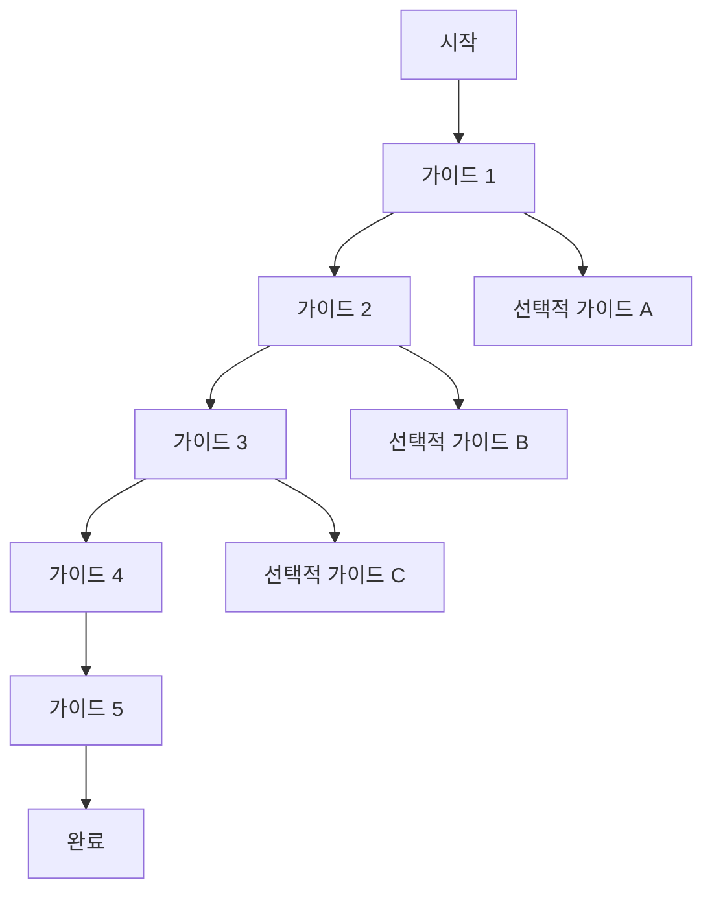

# 시리즈 [번호]: [시리즈 제목] - [부제목]

## 📖 시리즈 개요

이 시리즈는 [시리즈의 전체적인 목적과 범위]를 다룹니다. [시리즈가 해결하려는 문제나 달성하려는 목표에 대한 설명].

## 🎯 시리즈 목표

이 시리즈를 완료하면 다음을 달성할 수 있습니다:

- **[핵심 목표 1]**: [구체적인 달성 내용]
- **[핵심 목표 2]**: [구체적인 달성 내용]
- **[핵심 목표 3]**: [구체적인 달성 내용]
- **[핵심 목표 4]**: [구체적인 달성 내용]

## 📚 시리즈 구성

### [가이드 1]: [제목]
- **목적**: [가이드의 목적]
- **핵심 내용**: [주요 학습 내용]
- **예상 소요 시간**: [시간]

### [가이드 2]: [제목]
- **목적**: [가이드의 목적]
- **핵심 내용**: [주요 학습 내용]
- **예상 소요 시간**: [시간]

### [가이드 3]: [제목]
- **목적**: [가이드의 목적]
- **핵심 내용**: [주요 학습 내용]
- **예상 소요 시간**: [시간]

[시리즈의 모든 가이드에 대해 반복]

## 🔄 학습 경로



## 🛠️ 사전 요구사항

이 시리즈를 시작하기 전에 다음을 완료해야 합니다:

### 필수 요구사항
- [이전 시리즈 완료] 또는 [기본 지식 요구사항]
- [필요한 도구 설치]
- [개발 환경 설정]

### 권장 요구사항
- [추가 지식이나 경험]
- [관련 도구나 라이브러리]

## 📋 시리즈 체크리스트

### 준비 단계
- [ ] [사전 요구사항 1] 완료
- [ ] [사전 요구사항 2] 완료
- [ ] [개발 환경 설정] 완료
- [ ] [필요한 도구 설치] 완료

### 학습 단계
- [ ] [가이드 1] 완료
- [ ] [가이드 2] 완료
- [ ] [가이드 3] 완료
- [ ] [가이드 4] 완료
- [ ] [가이드 5] 완료

### 실습 단계
- [ ] [실습 프로젝트 1] 완료
- [ ] [실습 프로젝트 2] 완료
- [ ] [최종 프로젝트] 완료

## 🎓 학습 결과물

이 시리즈를 완료하면 다음과 같은 결과물을 얻게 됩니다:

### 기술적 결과물
- [구체적인 기술적 산출물 1]
- [구체적인 기술적 산출물 2]
- [구체적인 기술적 산출물 3]

### 지식적 결과물
- [학습된 지식이나 개념 1]
- [학습된 지식이나 개념 2]
- [학습된 지식이나 개념 3]

### 실무적 결과물
- [실무에 적용 가능한 결과물 1]
- [실무에 적용 가능한 결과물 2]
- [실무에 적용 가능한 결과물 3]

## 🔧 사용할 도구 및 기술

### 핵심 도구
- **[도구 1]**: [설명 및 용도]
- **[도구 2]**: [설명 및 용도]
- **[도구 3]**: [설명 및 용도]

### 지원 도구
- **[도구 4]**: [설명 및 용도]
- **[도구 5]**: [설명 및 용도]

### 라이브러리 및 프레임워크
- **[라이브러리 1]**: [설명 및 용도]
- **[라이브러리 2]**: [설명 및 용도]

## 📊 난이도 및 소요 시간

### 난이도 레벨
- **초급**: [가이드 범위]
- **중급**: [가이드 범위]
- **고급**: [가이드 범위]

### 예상 소요 시간
- **전체 시리즈**: [총 시간]
- **가이드당 평균**: [평균 시간]
- **실습 포함**: [실습 시간 포함]

## 🚀 시작하기

### 1단계: 환경 준비
```bash
# 환경 설정 명령어
setup-environment.sh
```

### 2단계: 첫 번째 가이드 시작
[첫 번째 가이드 링크]로 이동하여 시작하세요.

### 3단계: 진행 상황 추적
[진행 상황 추적 방법]을 사용하여 학습 진행도를 확인하세요.

## 🤝 커뮤니티 및 지원

### 질문 및 도움
- [커뮤니티 포럼 링크]
- [Discord/Slack 채널 링크]
- [GitHub Discussions 링크]

### 기여하기
- [기여 가이드 링크]
- [이슈 리포트 링크]
- [풀 리퀘스트 가이드 링크]

## 📚 관련 리소스

### 공식 문서
- [공식 문서 1]
- [공식 문서 2]
- [공식 문서 3]

### 추가 학습 자료
- [추가 자료 1]
- [추가 자료 2]
- [추가 자료 3]

### 영감을 주는 프로젝트
- [프로젝트 1]
- [프로젝트 2]
- [프로젝트 3]

---

**"[시리즈의 핵심 메시지]"** - [시리즈명]의 시작점
